<p align="center">
  <a href="https://viberdy.dev?ref=github"></a>
</p>

<h1 align="center">viberdy-dev/ui</h1>

<p align="center">
  <b>161 animated React components in 14 design styles.</b><br>
  Install one at a time with the shadcn CLI. Free, with an AI prompt for each.
</p>

<p align="center">
  
  
  
  
</p>

<p align="center">
  <a href="https://viberdy.dev/library?ref=github"><b>Live demos</b></a> ·
  <a href="#install">Install</a> ·
  <a href="#components">All components</a> ·
  <a href="#ai-prompts">AI prompts</a> ·
  <a href="#license">License</a>
</p>

```bash
npx shadcn@latest add viberdy-dev/ui/liquid-glass-button
```

```tsx
import { LiquidGlassButton } from "@/components/viberdy/liquid-glass-button";
```

No account, no API key. Use them in personal, commercial and client work; just don't sell them as a component library ([license](#license)).

<table>
<tr><td width="33%" valign="top"><a href="https://viberdy.dev/library/liquid-glass-button?ref=github">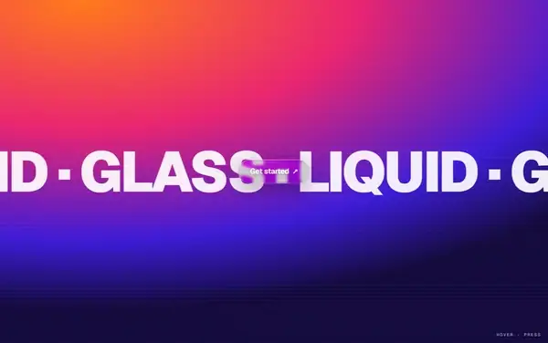</a><br><a href="https://viberdy.dev/library/liquid-glass-button?ref=github"><b>Liquid Glass Button</b></a> <sub>Glassmorphism</sub></td><td width="33%" valign="top"><a href="https://viberdy.dev/library/axis-scrub-heading?ref=github">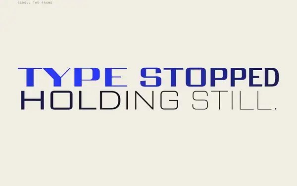</a><br><a href="https://viberdy.dev/library/axis-scrub-heading?ref=github"><b>Axis Scrub Heading</b></a> <sub>Kinetic Type</sub></td><td width="33%" valign="top"><a href="https://viberdy.dev/library/dither-develop-card?ref=github">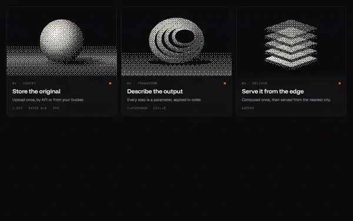</a><br><a href="https://viberdy.dev/library/dither-develop-card?ref=github"><b>Dither Develop Card</b></a> <sub>Dither &amp; ASCII</sub></td></tr>
<tr><td width="33%" valign="top"><a href="https://viberdy.dev/library/detent-dial-input?ref=github">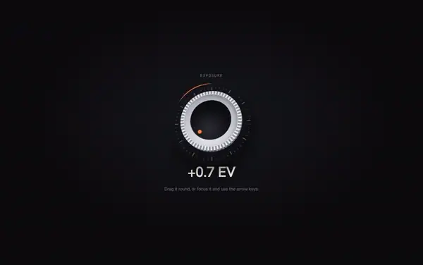</a><br><a href="https://viberdy.dev/library/detent-dial-input?ref=github"><b>Detent Dial Input</b></a> <sub>Spatial 3D</sub></td><td width="33%" valign="top"><a href="https://viberdy.dev/library/wobble-drop-card?ref=github">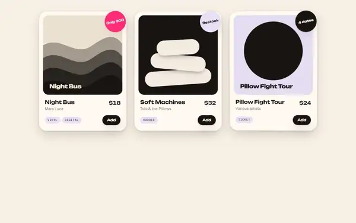</a><br><a href="https://viberdy.dev/library/wobble-drop-card?ref=github"><b>Wobble Drop Card</b></a> <sub>Tactile Maximalism</sub></td><td width="33%" valign="top"><a href="https://viberdy.dev/library/edge-invert-headline?ref=github"></a><br><a href="https://viberdy.dev/library/edge-invert-headline?ref=github"><b>Edge Invert Headline</b></a> <sub>Broken Grid</sub></td></tr>
<tr><td width="33%" valign="top"><a href="https://viberdy.dev/library/aurora-drift-text?ref=github">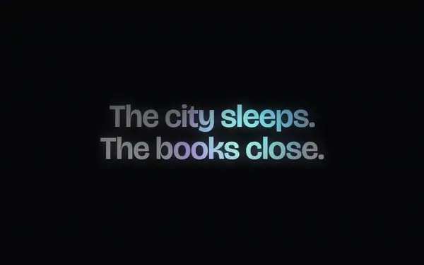</a><br><a href="https://viberdy.dev/library/aurora-drift-text?ref=github"><b>Aurora Drift Text</b></a> <sub>Aurora</sub></td><td width="33%" valign="top"><a href="https://viberdy.dev/library/pour-fill-heading?ref=github">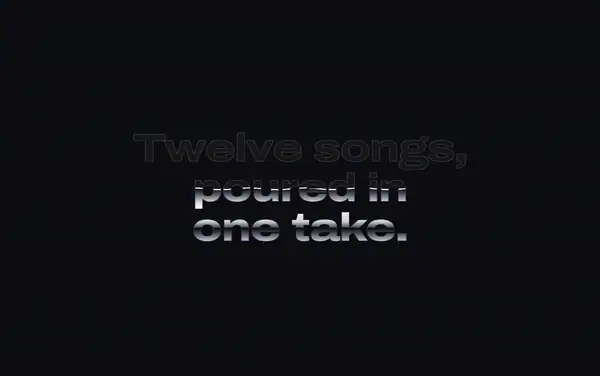</a><br><a href="https://viberdy.dev/library/pour-fill-heading?ref=github"><b>Pour Fill Heading</b></a> <sub>Liquid Chrome</sub></td><td width="33%" valign="top"><a href="https://viberdy.dev/library/window-light-drift?ref=github">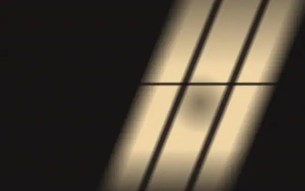</a><br><a href="https://viberdy.dev/library/window-light-drift?ref=github"><b>Window Light Drift</b></a> <sub>Essentials</sub></td></tr>
</table>

## Install

Every component is one file, and every name in this README installs the same way. The CLI reads [`registry.json`](registry.json) from this repo, copies the file to `components/viberdy/<name>.tsx` and installs the npm packages it imports.

```bash
npx shadcn@latest add viberdy-dev/ui/card-carousel-3d viberdy-dev/ui/flip-card   # several at once
npx shadcn@latest list viberdy-dev/ui                                       # everything in this registry
npx shadcn@latest view viberdy-dev/ui/liquid-glass-button                    # inspect before installing
```

No shadcn set up? Copy the file from [`components/`](components) and install what it imports.

- **The export name can differ from the file name** (`card-carousel-3d` exports `CardCarousel3D`), so import what the file exports. Props are typed on the function.
- **Stack:** React 18 or 19 and Tailwind CSS v4, built for the Next.js App Router. Each file is a client component (`"use client"`). 112 need nothing beyond React; the rest add `framer-motion` (48) or `lucide-react` (11). No network calls, no telemetry.
- **Typefaces:** components designed around a particular face read it from a CSS variable (such as `--font-display`) and fall back to your sans font. Most name the face and how to load it in their header comment.

<h2 id="components">All components</h2>

[Aurora](#aurora) (6) · [Bento Box](#bento) (6) · [Broken Grid](#broken-grid) (6) · [Brutalism](#brutalism) (6) · [Dark Precision](#dark-precision) (9) · [Diffused Glow](#diffused-glow) (6) · [Dither & ASCII](#dither-ascii) (6) · [Editorial](#editorial) (3) · [Glassmorphism](#glassmorphism) (6) · [Kinetic Type](#kinetic-type) (7) · [Liquid Chrome](#liquid-chrome) (6) · [Modern Minimal](#modern-minimal) (6) · [Spatial 3D](#spatial-3d) (7) · [Tactile Maximalism](#tactile-maximalism) (6) · [Essentials](#essentials) (75)

<h3 id="aurora">Aurora</h3>

Light curtains on a dark sky that drift slowly and lean toward the pointer. [Live demos →](https://viberdy.dev/styles/aurora?ref=github)

<table>
<tr><td width="33%" valign="top"><a href="https://viberdy.dev/library/aurora-drift-text?ref=github">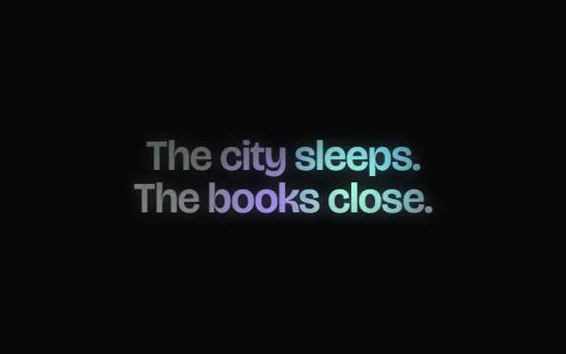</a><br><a href="https://viberdy.dev/library/aurora-drift-text?ref=github"><b>Aurora Drift Text</b></a><br><sub>Display type filled with aurora light: three bands drift through the letters on slow loops, ray threads slide through them, and the brightest band leans toward the pointer when it comes near.</sub><br><sub><code>aurora-drift-text</code> · <a href="components/aurora-drift-text.tsx">code</a> · <a href="prompts/aurora-drift-text.md">prompt</a></sub></td><td width="33%" valign="top"><a href="https://viberdy.dev/library/aurora-flow-nav?ref=github">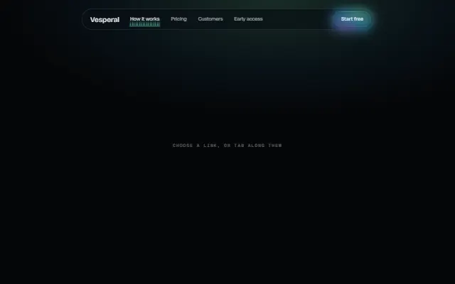</a><br><a href="https://viberdy.dev/library/aurora-flow-nav?ref=github"><b>Aurora Flow Nav</b></a><br><sub>A floating night-glass nav whose active mark is a band of aurora light that takes the colour of the sky above its link and flows to the next one leading edge first.</sub><br><sub><code>aurora-flow-nav</code> · <a href="components/aurora-flow-nav.tsx">code</a> · <a href="prompts/aurora-flow-nav.md">prompt</a></sub></td><td width="33%" valign="top"><a href="https://viberdy.dev/library/aurora-glow-button?ref=github">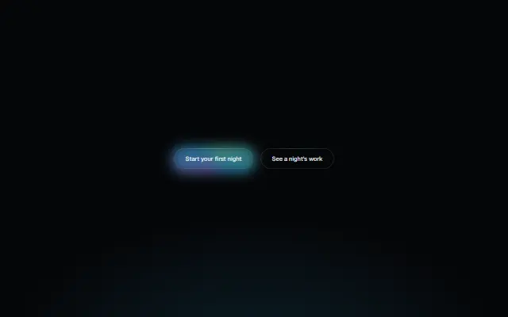</a><br><a href="https://viberdy.dev/library/aurora-glow-button?ref=github"><b>Aurora Glow Button</b></a><br><sub>A night-glass pill with a sliver of aurora under it, turning on a 60s clock that every button on the page shares, spreading on hover and sending a ring of light out on press.</sub><br><sub><code>aurora-glow-button</code> · <a href="components/aurora-glow-button.tsx">code</a> · <a href="prompts/aurora-glow-button.md">prompt</a></sub></td></tr>
<tr><td width="33%" valign="top"><a href="https://viberdy.dev/library/aurora-glow-input?ref=github">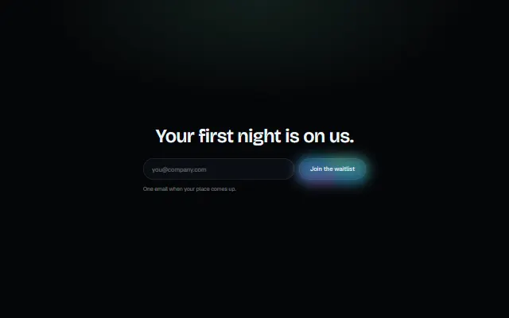</a><br><a href="https://viberdy.dev/library/aurora-glow-input?ref=github"><b>Aurora Glow Input</b></a><br><sub>A waitlist field that lights like the sky: focus raises a two-hue bloom and lights the rim, every keystroke sends a rose ripple from the caret, and joining sweeps the whole palette once.</sub><br><sub><code>aurora-glow-input</code> · <a href="components/aurora-glow-input.tsx">code</a> · <a href="prompts/aurora-glow-input.md">prompt</a></sub></td><td width="33%" valign="top"><a href="https://viberdy.dev/library/aurora-ribbon-cursor?ref=github">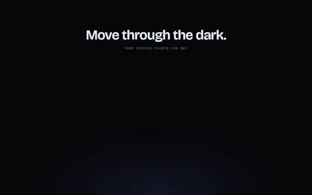</a><br><a href="https://viberdy.dev/library/aurora-ribbon-cursor?ref=github"><b>Aurora Ribbon Cursor</b></a><br><sub>The pointer paints a small aurora: a ribbon of light coloured from the indigo fringe to rose that fades like the sky, sending short rays up from every point so the trail reads as a curtain.</sub><br><sub><code>aurora-ribbon-cursor</code> · <a href="components/aurora-ribbon-cursor.tsx">code</a> · <a href="prompts/aurora-ribbon-cursor.md">prompt</a></sub></td><td width="33%" valign="top"><a href="https://viberdy.dev/library/aurora-rim-card?ref=github">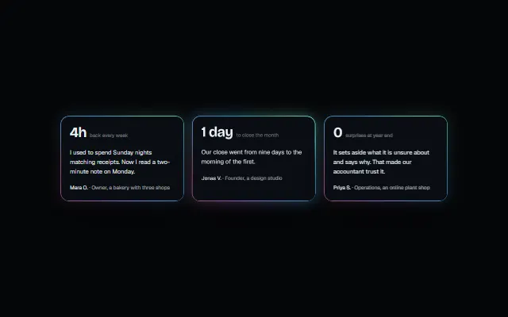</a><br><a href="https://viberdy.dev/library/aurora-rim-card?ref=github"><b>Aurora Rim Card</b></a><br><sub>A night-glass card with a slow aurora rim that turns once every 52 seconds, feathered into light, brightening near the pointer while the card tilts a hair toward it.</sub><br><sub><code>aurora-rim-card</code> · <a href="components/aurora-rim-card.tsx">code</a> · <a href="prompts/aurora-rim-card.md">prompt</a></sub></td></tr>
</table>

<h3 id="bento">Bento Box</h3>

Content filed into a grid of rounded compartments of mixed sizes. [Live demos →](https://viberdy.dev/styles/bento?ref=github)

<table>
<tr><td width="33%" valign="top"><a href="https://viberdy.dev/library/bento-command-nav?ref=github">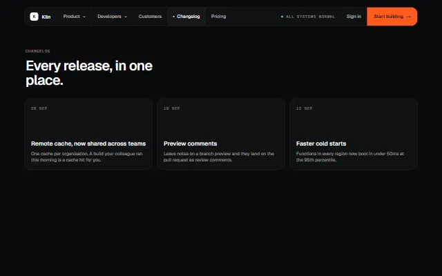</a><br><a href="https://viberdy.dev/library/bento-command-nav?ref=github"><b>Bento Command Nav</b></a><br><sub>Site navigation as one row of bento tiles sharing 1px hairlines, with a pointer light that shows through them and menus that open as panels of tiles.</sub><br><sub><code>bento-command-nav</code> · <a href="components/bento-command-nav.tsx">code</a> · <a href="prompts/bento-command-nav.md">prompt</a></sub></td><td width="33%" valign="top"><a href="https://viberdy.dev/library/bento-footer-grid?ref=github">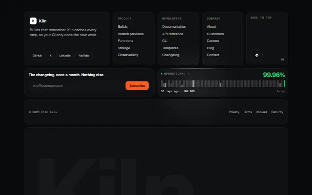</a><br><a href="https://viberdy.dev/library/bento-footer-grid?ref=github"><b>Bento Footer Grid</b></a><br><sub>A bento footer whose tiles are live: a 90-day uptime strip you can read day by day, a back-to-top ring that fills as you scroll, a newsletter that widens across its row as its neighbours reflow, and a wordmark that rises into its crop.</sub><br><sub><code>bento-footer-grid</code> · <a href="components/bento-footer-grid.tsx">code</a> · <a href="prompts/bento-footer-grid.md">prompt</a></sub></td><td width="33%" valign="top"><a href="https://viberdy.dev/library/capture-loop-card?ref=github">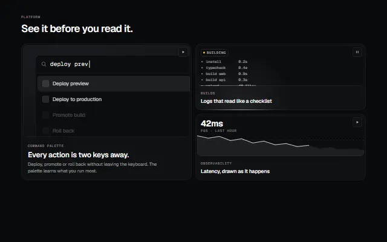</a><br><a href="https://viberdy.dev/library/capture-loop-card?ref=github"><b>Capture Loop Card</b></a><br><sub>A bento tile whose picture is a tightly cropped loop of your product, still until someone hovers or presses play, with a hairline that tracks the loop.</sub><br><sub><code>capture-loop-card</code> · <a href="components/capture-loop-card.tsx">code</a> · <a href="prompts/capture-loop-card.md">prompt</a></sub></td></tr>
<tr><td width="33%" valign="top"><a href="https://viberdy.dev/library/hairline-tile-button?ref=github">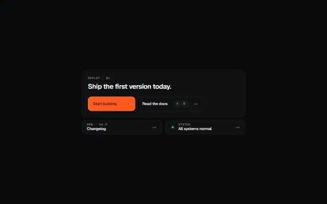</a><br><a href="https://viberdy.dev/library/hairline-tile-button?ref=github"><b>Hairline Tile Button</b></a><br><sub>A button that behaves like a live bento grid: on hover it re-tiles into compartments along lit hairline seams, compresses toward your press, and its keycaps are a real keyboard shortcut.</sub><br><sub><code>hairline-tile-button</code> · <a href="components/hairline-tile-button.tsx">code</a> · <a href="prompts/hairline-tile-button.md">prompt</a></sub></td><td width="33%" valign="top"><a href="https://viberdy.dev/library/spec-numeral-tile?ref=github">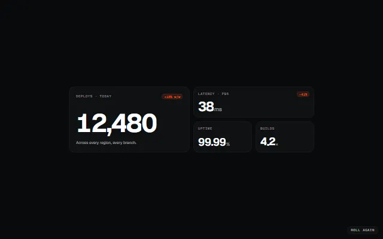</a><br><a href="https://viberdy.dev/library/spec-numeral-tile?ref=github"><b>Spec Numeral Tile</b></a><br><sub>A big bold numeral in a spec-sheet voice whose digits roll into place like an odometer, set in a hairline bento tile.</sub><br><sub><code>spec-numeral-tile</code> · <a href="components/spec-numeral-tile.tsx">code</a> · <a href="prompts/spec-numeral-tile.md">prompt</a></sub></td><td width="33%" valign="top"><a href="https://viberdy.dev/library/widget-reorder-input?ref=github">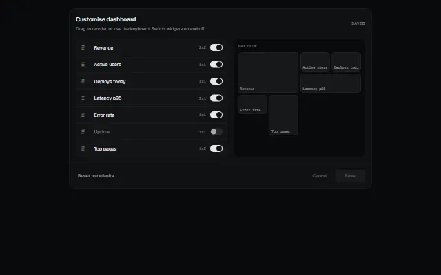</a><br><a href="https://viberdy.dev/library/widget-reorder-input?ref=github"><b>Widget Reorder Input</b></a><br><sub>A &quot;customise your dashboard&quot; panel: drag or keyboard reorder, show and hide switches, a live miniature of the result, and save, cancel and reset.</sub><br><sub><code>widget-reorder-input</code> · <a href="components/widget-reorder-input.tsx">code</a> · <a href="prompts/widget-reorder-input.md">prompt</a></sub></td></tr>
</table>

<h3 id="broken-grid">Broken Grid</h3>

A visible grid and one rule that breaks it: every third module overlaps its neighbour, and the break passes on as the layout changes. [Live demos →](https://viberdy.dev/styles/broken-grid?ref=github)

<table>
<tr><td width="33%" valign="top"><a href="https://viberdy.dev/library/edge-invert-headline?ref=github">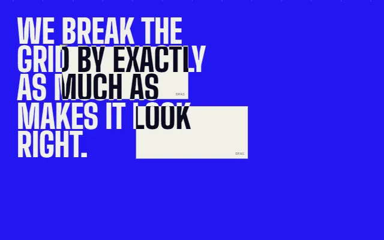</a><br><a href="https://viberdy.dev/library/edge-invert-headline?ref=github"><b>Edge Invert Headline</b></a><br><sub>A caps headline that inverts exactly at the edges of the plates under it; drag a plate and the inversion follows 1:1, then snaps to a lattice cell, and on column 3, 6 or 9 the plate breaks by the rule.</sub><br><sub><code>edge-invert-headline</code> · <a href="components/edge-invert-headline.tsx">code</a> · <a href="prompts/edge-invert-headline.md">prompt</a></sub></td><td width="33%" valign="top"><a href="https://viberdy.dev/library/hanging-label-input?ref=github">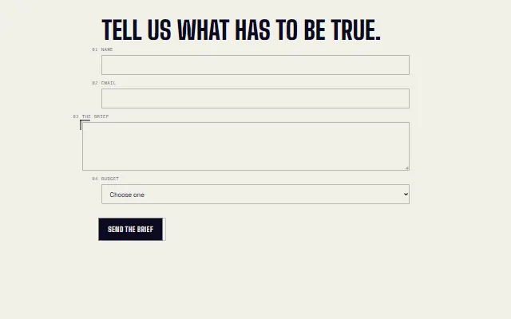</a><br><a href="https://viberdy.dev/library/hanging-label-input?ref=github"><b>Hanging Label Input</b></a><br><sub>A contact form whose numbered labels hang one gutter off the lattice and step into line in 160ms when you use the field; the third row breaks by the rule, and it only claims to send when it has a handler.</sub><br><sub><code>hanging-label-input</code> · <a href="components/hanging-label-input.tsx">code</a> · <a href="prompts/hanging-label-input.md">prompt</a></sub></td><td width="33%" valign="top"><a href="https://viberdy.dev/library/index-step-nav?ref=github">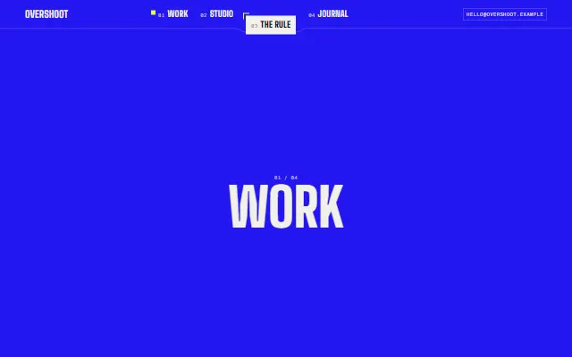</a><br><a href="https://viberdy.dev/library/index-step-nav?ref=github"><b>Index Step Nav</b></a><br><sub>A numbered nav whose third item hangs one gutter below the bar on a contrasting plate by the rule, the bar's hairline dipping under it, and a tag that steps to the current item, or the one you point at, in four ticks.</sub><br><sub><code>index-step-nav</code> · <a href="components/index-step-nav.tsx">code</a> · <a href="prompts/index-step-nav.md">prompt</a></sub></td></tr>
<tr><td width="33%" valign="top"><a href="https://viberdy.dev/library/offset-target-button?ref=github">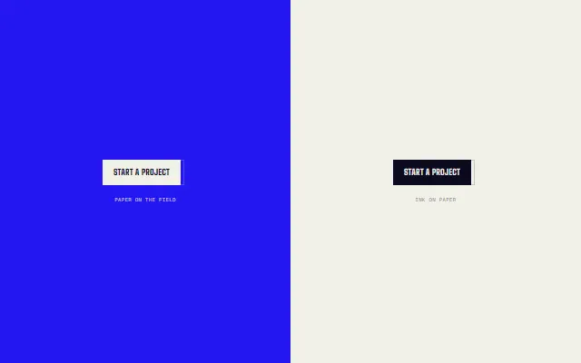</a><br><a href="https://viberdy.dev/library/offset-target-button?ref=github"><b>Offset Target Button</b></a><br><sub>A button whose label plate hangs off its hairline target along the grid's axis, reaches further and lights its bracket on hover or focus, and seats into the target in 120ms when you press it.</sub><br><sub><code>offset-target-button</code> · <a href="components/offset-target-button.tsx">code</a> · <a href="prompts/offset-target-button.md">prompt</a></sub></td><td width="33%" valign="top"><a href="https://viberdy.dev/library/rule-handoff-flip?ref=github">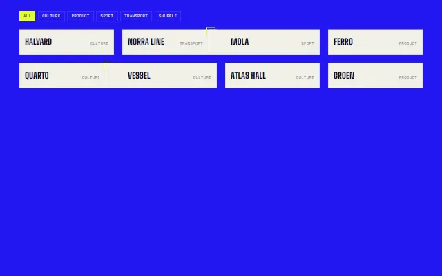</a><br><a href="https://viberdy.dev/library/rule-handoff-flip?ref=github"><b>Rule Handoff Flip</b></a><br><sub>The kit's rule for any list: items become plates on the lattice and every third breaks; filter, sort or add and everything moves from where it was in 380ms while the break passes to whichever item is now third.</sub><br><sub><code>rule-handoff-flip</code> · <a href="components/rule-handoff-flip.tsx">code</a> · <a href="prompts/rule-handoff-flip.md">prompt</a></sub></td><td width="33%" valign="top"><a href="https://viberdy.dev/library/z-swap-plate-card?ref=github">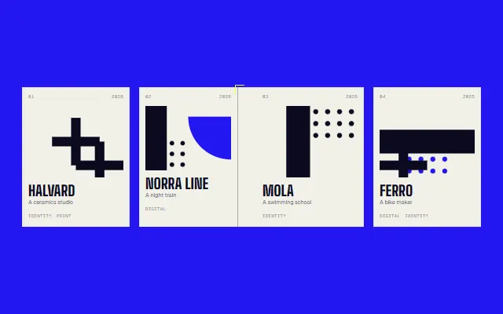</a><br><a href="https://viberdy.dev/library/z-swap-plate-card?ref=github"><b>Z-Swap Plate Card</b></a><br><sub>A work card on the lattice: every third in a run breaks by the rule, two gutters out with the bracket, and hovering the card it overlaps lifts that card above it, the bracket going with the lift, in 240ms.</sub><br><sub><code>z-swap-plate-card</code> · <a href="components/z-swap-plate-card.tsx">code</a> · <a href="prompts/z-swap-plate-card.md">prompt</a></sub></td></tr>
</table>

<h3 id="brutalism">Brutalism</h3>

Thick ink borders, hard offset shadows, one loud accent and presses that land exactly. [Live demos →](https://viberdy.dev/styles/brutalism?ref=github)

<table>
<tr><td width="33%" valign="top"><a href="https://viberdy.dev/library/black-border-form?ref=github">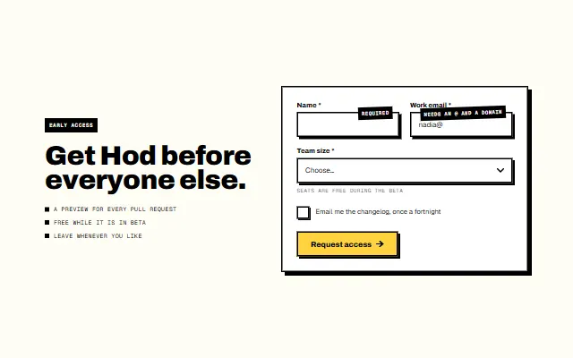</a><br><a href="https://viberdy.dev/library/black-border-form?ref=github"><b>Black Border Form</b></a><br><sub>Neo-brutalist form fields in 3px ink: focus presses a field into its shadow, and errors are stamped on as tilted black tags. The browser's own validation, a posting form and a received stamp.</sub><br><sub><code>black-border-form</code> · <a href="components/black-border-form.tsx">code</a> · <a href="prompts/black-border-form.md">prompt</a></sub></td><td width="33%" valign="top"><a href="https://viberdy.dev/library/offset-shadow-card?ref=github">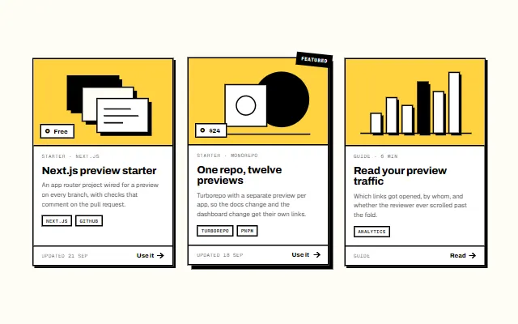</a><br><a href="https://viberdy.dev/library/offset-shadow-card?ref=github"><b>Offset Shadow Card</b></a><br><sub>A neo-brutalist card on a hard shadow: it lifts 2px on hover and lands on the shadow when pressed. A flat drawn motif or a photo, a punched price tag, a sticker badge, 3px ink throughout.</sub><br><sub><code>offset-shadow-card</code> · <a href="components/offset-shadow-card.tsx">code</a> · <a href="prompts/offset-shadow-card.md">prompt</a></sub></td><td width="33%" valign="top"><a href="https://viberdy.dev/library/punch-card-field?ref=github">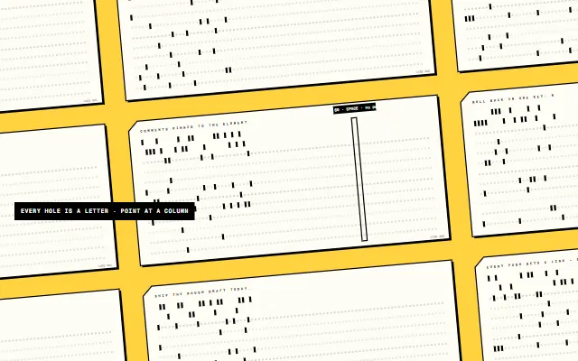</a><br><a href="https://viberdy.dev/library/punch-card-field?ref=github"><b>Punch Card Field</b></a><br><sub>A background of 80-column punch cards whose holes spell real text in Hollerith code. Holes are punched in column by column on arrival; point at a column to decode it.</sub><br><sub><code>punch-card-field</code> · <a href="components/punch-card-field.tsx">code</a> · <a href="prompts/punch-card-field.md">prompt</a></sub></td></tr>
<tr><td width="33%" valign="top"><a href="https://viberdy.dev/library/pushed-shadow-button?ref=github">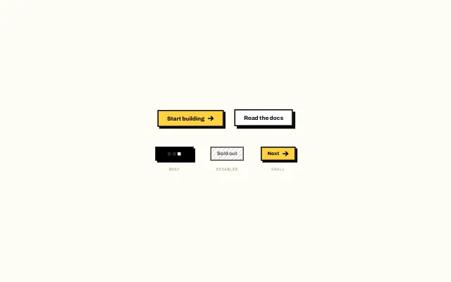</a><br><a href="https://viberdy.dev/library/pushed-shadow-button?ref=github"><b>Pushed Shadow Button</b></a><br><sub>A neo-brutalist button on a hard 5px shadow: hover lifts it 2px, a press lands it exactly on its shadow. 3px ink everywhere, 100ms linear, no blur.</sub><br><sub><code>pushed-shadow-button</code> · <a href="components/pushed-shadow-button.tsx">code</a> · <a href="prompts/pushed-shadow-button.md">prompt</a></sub></td><td width="33%" valign="top"><a href="https://viberdy.dev/library/warning-tape-footer?ref=github">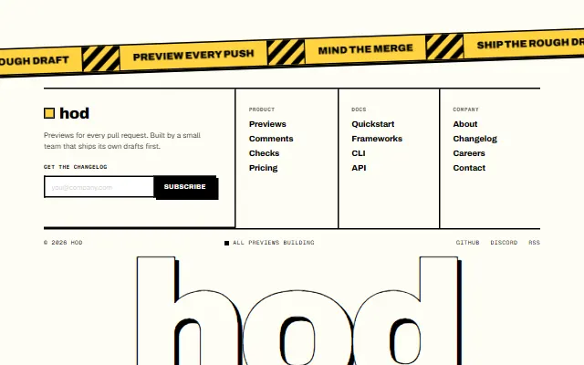</a><br><a href="https://viberdy.dev/library/warning-tape-footer?ref=github"><b>Warning Tape Footer</b></a><br><sub>A neo-brutalist footer under a strip of hazard tape you can grab and throw on its slow 48-second crawl, a sign-up that stamps the tape, and a giant wordmark whose letters press down onto their own ink plates.</sub><br><sub><code>warning-tape-footer</code> · <a href="components/warning-tape-footer.tsx">code</a> · <a href="prompts/warning-tape-footer.md">prompt</a></sub></td><td width="33%" valign="top"><a href="https://viberdy.dev/library/weight-slam-text?ref=github">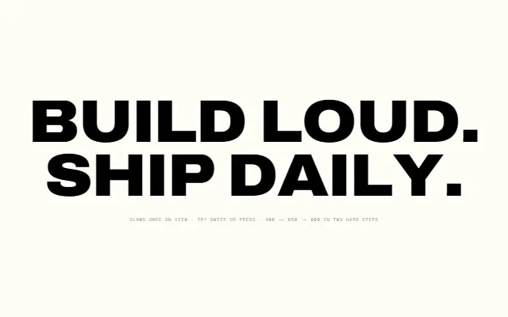</a><br><a href="https://viberdy.dev/library/weight-slam-text?ref=github"><b>Weight Slam Text</b></a><br><sub>Display type whose weight slams instead of easing: letters jump 400 → 650 → 900 in two hard steps, left to right like a row of stamps, and let go in three.</sub><br><sub><code>weight-slam-text</code> · <a href="components/weight-slam-text.tsx">code</a> · <a href="prompts/weight-slam-text.md">prompt</a></sub></td></tr>
</table>

<h3 id="dark-precision">Dark Precision</h3>

OLED black, 1px hairlines and light that answers the pointer: beams, lit borders, lit grids. [Live demos →](https://viberdy.dev/styles/dark-precision?ref=github)

<table>
<tr><td width="33%" valign="top"><a href="https://viberdy.dev/library/beam-connector?ref=github">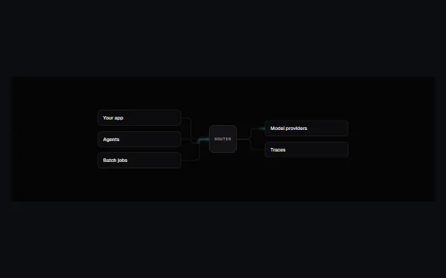</a><br><a href="https://viberdy.dev/library/beam-connector?ref=github"><b>Beam Connector</b></a><br><sub>A hairline beam between any two elements, routed with rounded right-angle elbows, that carries a pulse of light once per cycle and lands with a flash at the far end.</sub><br><sub><code>beam-connector</code> · <a href="components/beam-connector.tsx">code</a> · <a href="prompts/beam-connector.md">prompt</a></sub></td><td width="33%" valign="top"><a href="https://viberdy.dev/library/beam-sweep-backdrop?ref=github">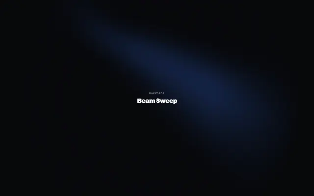</a><br><a href="https://viberdy.dev/library/beam-sweep-backdrop?ref=github"><b>Beam Sweep Backdrop</b></a><br><sub>Slow conic light beams rotating behind content, CSS-only and compositor-friendly.</sub><br><sub><code>beam-sweep-backdrop</code> · <a href="components/beam-sweep-backdrop.tsx">code</a> · <a href="prompts/beam-sweep-backdrop.md">prompt</a></sub></td><td width="33%" valign="top"><a href="https://viberdy.dev/library/deploy-log-input?ref=github">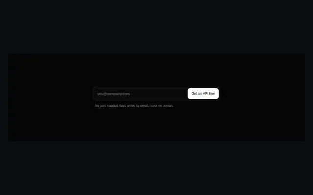</a><br><a href="https://viberdy.dev/library/deploy-log-input?ref=github"><b>Deploy Log Input</b></a><br><sub>An email field that answers with a streaming log: on submit, short lines stream under it with spinners turning into checks while a beam of light runs along its top edge, and the last line waits for your handler.</sub><br><sub><code>deploy-log-input</code> · <a href="components/deploy-log-input.tsx">code</a> · <a href="prompts/deploy-log-input.md">prompt</a></sub></td></tr>
<tr><td width="33%" valign="top"><a href="https://viberdy.dev/library/horizon-light-footer?ref=github">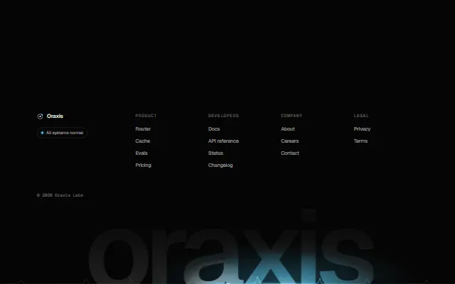</a><br><a href="https://viberdy.dev/library/horizon-light-footer?ref=github"><b>Horizon Light Footer</b></a><br><sub>A footer whose giant wordmark is lit from below by a horizon that is also a signal: a latency trace lit where the pointer is, with a request pulse that runs it every few seconds and lights the letters as it passes.</sub><br><sub><code>horizon-light-footer</code> · <a href="components/horizon-light-footer.tsx">code</a> · <a href="prompts/horizon-light-footer.md">prompt</a></sub></td><td width="33%" valign="top"><a href="https://viberdy.dev/library/orbit-light-button?ref=github">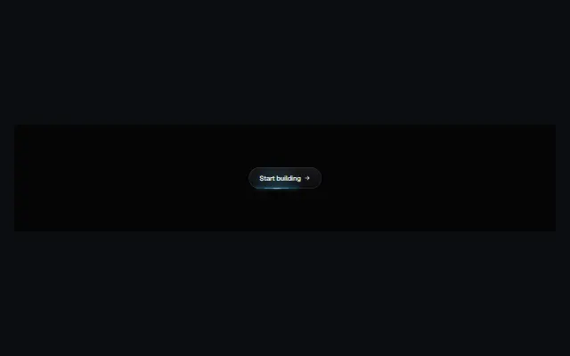</a><br><a href="https://viberdy.dev/library/orbit-light-button?ref=github"><b>Orbit Light Button</b></a><br><sub>A dark pill whose border carries one light: it laps the outline slowly, glides to the nearest point of the border under the pointer and lights the surface from there, and a press sends a ring outward.</sub><br><sub><code>orbit-light-button</code> · <a href="components/orbit-light-button.tsx">code</a> · <a href="prompts/orbit-light-button.md">prompt</a></sub></td><td width="33%" valign="top"><a href="https://viberdy.dev/library/pointer-lit-card?ref=github">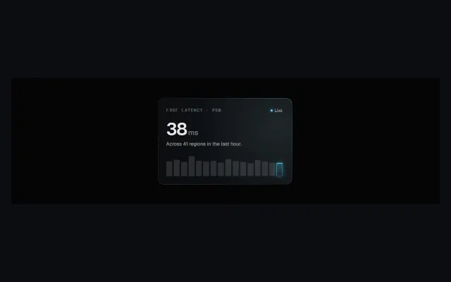</a><br><a href="https://viberdy.dev/library/pointer-lit-card?ref=github"><b>Pointer Lit Card</b></a><br><sub>A card lit from the pointer: a bright arc of light on the hairline border, a softer wash across the surface, a two-degree tilt toward the pointer and a little counter-parallax on the content.</sub><br><sub><code>pointer-lit-card</code> · <a href="components/pointer-lit-card.tsx">code</a> · <a href="prompts/pointer-lit-card.md">prompt</a></sub></td></tr>
<tr><td width="33%" valign="top"><a href="https://viberdy.dev/library/pointer-warp-dot-field?ref=github">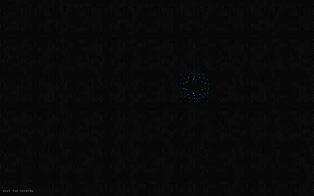</a><br><a href="https://viberdy.dev/library/pointer-warp-dot-field?ref=github"><b>Pointer Warp Dot Field</b></a><br><sub>A canvas dot grid that bulges and brightens away from the cursor.</sub><br><sub><code>pointer-warp-dot-field</code> · <a href="components/pointer-warp-dot-field.tsx">code</a> · <a href="prompts/pointer-warp-dot-field.md">prompt</a></sub></td><td width="33%" valign="top"><a href="https://viberdy.dev/library/signal-field?ref=github">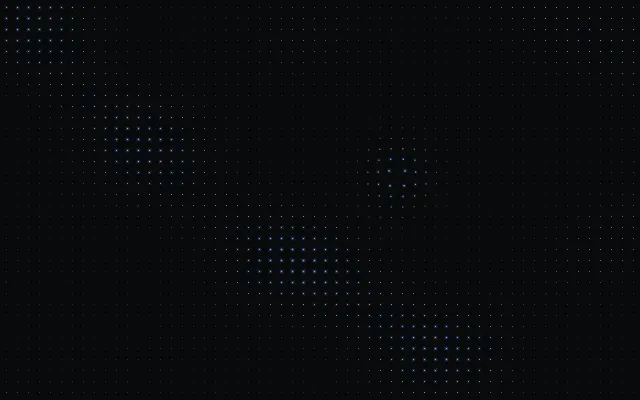</a><br><a href="https://viberdy.dev/library/signal-field?ref=github"><b>Signal Field</b></a><br><sub>A machined dot grid lit by slow waves of light, with a pointer lens and click ripples.</sub><br><sub><code>signal-field</code> · <a href="components/signal-field.tsx">code</a> · <a href="prompts/signal-field.md">prompt</a></sub></td><td width="33%" valign="top"><a href="https://viberdy.dev/library/slit-light-heading?ref=github">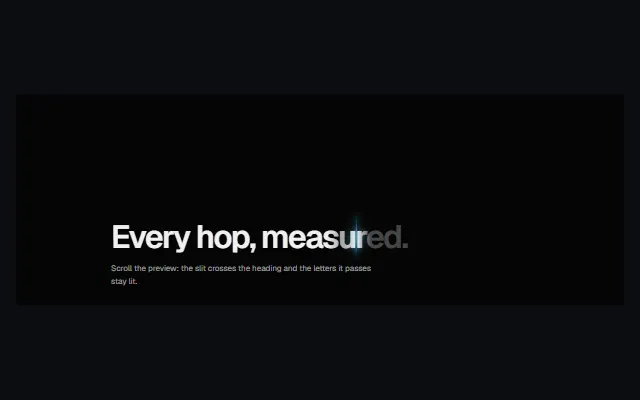</a><br><a href="https://viberdy.dev/library/slit-light-heading?ref=github"><b>Slit Light Heading</b></a><br><sub>A heading lit by a narrow slit of light that crosses it as it scrolls into view: letters under the slit burn white, letters it has passed stay lit, letters ahead wait in the dark.</sub><br><sub><code>slit-light-heading</code> · <a href="components/slit-light-heading.tsx">code</a> · <a href="prompts/slit-light-heading.md">prompt</a></sub></td></tr>
</table>

<h3 id="diffused-glow">Diffused Glow</h3>

Soft grainy halos on deep or jewel-tone fields, a refined serif and one calm reaction per view. [Live demos →](https://viberdy.dev/styles/diffused-glow?ref=github)

<table>
<tr><td width="33%" valign="top"><a href="https://viberdy.dev/library/aura-booking-picker?ref=github">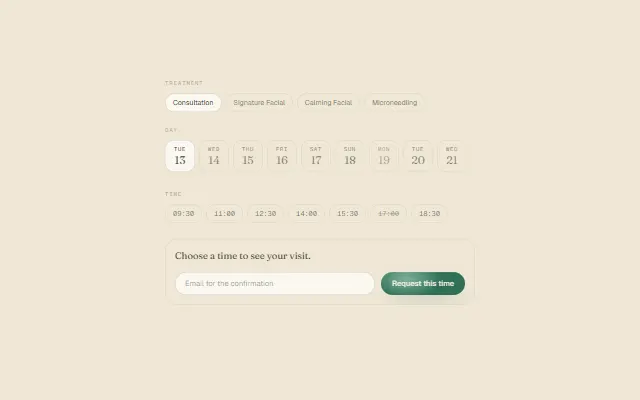</a><br><a href="https://viberdy.dev/library/aura-booking-picker?ref=github"><b>Aura Booking Picker</b></a><br><sub>A booking picker in three quiet steps, treatment, day and time, where the chosen time blooms into a grained halo, and a request that needs your handler before it confirms anything.</sub><br><sub><code>aura-booking-picker</code> · <a href="components/aura-booking-picker.tsx">code</a> · <a href="prompts/aura-booking-picker.md">prompt</a></sub></td><td width="33%" valign="top"><a href="https://viberdy.dev/library/breath-pacer-ring?ref=github">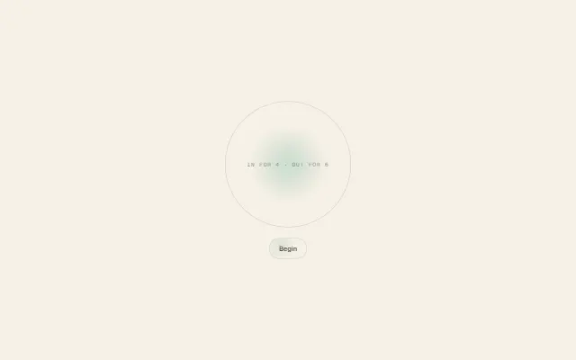</a><br><a href="https://viberdy.dev/library/breath-pacer-ring?ref=github"><b>Breath Pacer Ring</b></a><br><sub>A breathing guide in soft light: a grained halo swells as you breathe in and settles as you breathe out, a thin ring traces each phase and the seconds count down; it starts only when asked.</sub><br><sub><code>breath-pacer-ring</code> · <a href="components/breath-pacer-ring.tsx">code</a> · <a href="prompts/breath-pacer-ring.md">prompt</a></sub></td><td width="33%" valign="top"><a href="https://viberdy.dev/library/dusk-set-footer?ref=github">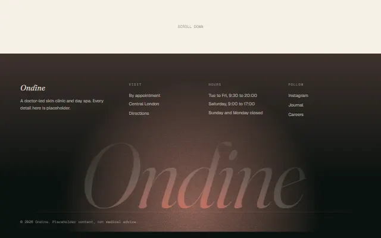</a><br><a href="https://viberdy.dev/library/dusk-set-footer?ref=github"><b>Dusk Set Footer</b></a><br><sub>A footer that sets like the sun: as it scrolls in, a grained halo sinks toward a hairline horizon, warming from gold through rose to ember, behind a giant italic serif wordmark.</sub><br><sub><code>dusk-set-footer</code> · <a href="components/dusk-set-footer.tsx">code</a> · <a href="prompts/dusk-set-footer.md">prompt</a></sub></td></tr>
<tr><td width="33%" valign="top"><a href="https://viberdy.dev/library/halo-treatment-card?ref=github">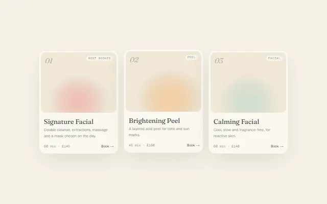</a><br><a href="https://viberdy.dev/library/halo-treatment-card?ref=github"><b>Halo Treatment Card</b></a><br><sub>A treatment card with a light well: a grained halo in the treatment's own colour rests low, then rises and blooms toward the pointer on hover or focus while the card lifts on a feathered shadow.</sub><br><sub><code>halo-treatment-card</code> · <a href="components/halo-treatment-card.tsx">code</a> · <a href="prompts/halo-treatment-card.md">prompt</a></sub></td><td width="33%" valign="top"><a href="https://viberdy.dev/library/soft-glow-button?ref=github">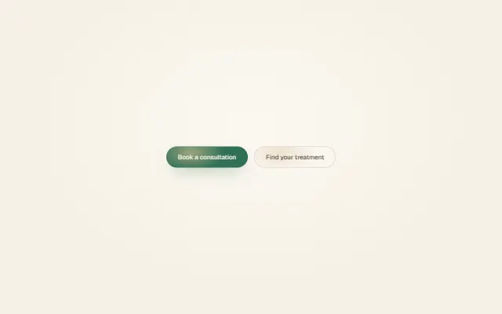</a><br><a href="https://viberdy.dev/library/soft-glow-button?ref=github"><b>Soft Glow Button</b></a><br><sub>A pill with a grained light inside it that follows the pointer with a slow settle, a diffused bloom that rises behind it, and a press that exhales a soft ring of light.</sub><br><sub><code>soft-glow-button</code> · <a href="components/soft-glow-button.tsx">code</a> · <a href="prompts/soft-glow-button.md">prompt</a></sub></td><td width="33%" valign="top"><a href="https://viberdy.dev/library/veil-resolve-heading?ref=github">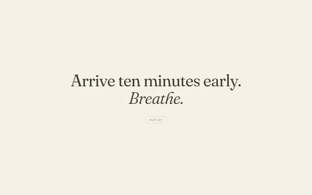</a><br><a href="https://viberdy.dev/library/veil-resolve-heading?ref=github"><b>Veil Resolve Heading</b></a><br><sub>A serif heading that arrives out of soft light: each word condenses from a blur into focus with an 80ms stagger while a glow blooms behind the words and fades as they sharpen.</sub><br><sub><code>veil-resolve-heading</code> · <a href="components/veil-resolve-heading.tsx">code</a> · <a href="prompts/veil-resolve-heading.md">prompt</a></sub></td></tr>
</table>

<h3 id="dither-ascii">Dither & ASCII</h3>

Real-time dithering, halftone and ASCII shaders that make any image look printed on purpose. [Live demos →](https://viberdy.dev/styles/dither-ascii?ref=github)

<table>
<tr><td width="33%" valign="top"><a href="https://viberdy.dev/library/ascii-density-nav?ref=github">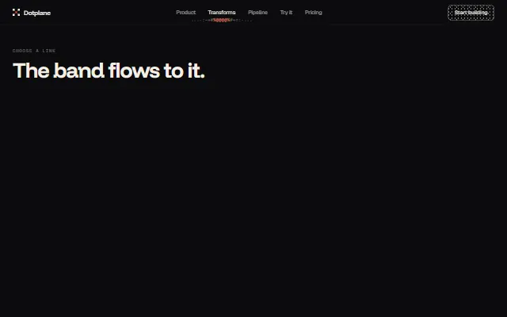</a><br><a href="https://viberdy.dev/library/ascii-density-nav?ref=github"><b>ASCII Density Nav</b></a><br><sub>A nav whose active link is marked by a band of ASCII density: characters thicken through a ramp under the active link and flow to the next one on a spring, its peak in signal.</sub><br><sub><code>ascii-density-nav</code> · <a href="components/ascii-density-nav.tsx">code</a> · <a href="prompts/ascii-density-nav.md">prompt</a></sub></td><td width="33%" valign="top"><a href="https://viberdy.dev/library/ascii-resolve-heading?ref=github">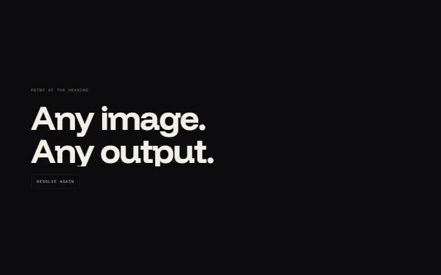</a><br><a href="https://viberdy.dev/library/ascii-resolve-heading?ref=github"><b>ASCII Resolve Heading</b></a><br><sub>A heading that resolves from ASCII into type: its own letterforms redrawn in shape-matched glyphs step from coarse to fine as it comes into view, then a lens under the pointer shows the glyphs again.</sub><br><sub><code>ascii-resolve-heading</code> · <a href="components/ascii-resolve-heading.tsx">code</a> · <a href="prompts/ascii-resolve-heading.md">prompt</a></sub></td><td width="33%" valign="top"><a href="https://viberdy.dev/library/bayer-dissolve?ref=github">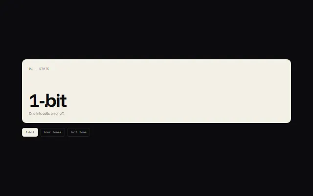</a><br><a href="https://viberdy.dev/library/bayer-dissolve?ref=github"><b>Bayer Dissolve</b></a><br><sub>An ordered-dither transition: a new state prints in over the old one in 8x8 Bayer order while the screen refines from coarse cells to fine, or prints in from the ground on first view.</sub><br><sub><code>bayer-dissolve</code> · <a href="components/bayer-dissolve.tsx">code</a> · <a href="prompts/bayer-dissolve.md">prompt</a></sub></td></tr>
<tr><td width="33%" valign="top"><a href="https://viberdy.dev/library/bayer-fill-button?ref=github">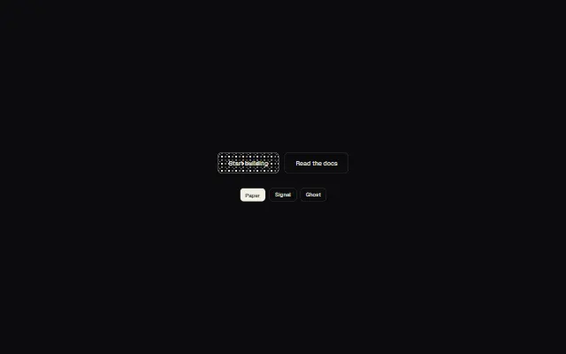</a><br><a href="https://viberdy.dev/library/bayer-fill-button?ref=github"><b>Bayer Fill Button</b></a><br><sub>A button whose fill prints in cell by cell through the 8x8 Bayer order on hover and focus, with its label inverting exactly where each cell lands; press it and the screen halves to a finer grid.</sub><br><sub><code>bayer-fill-button</code> · <a href="components/bayer-fill-button.tsx">code</a> · <a href="prompts/bayer-fill-button.md">prompt</a></sub></td><td width="33%" valign="top"><a href="https://viberdy.dev/library/dither-develop-card?ref=github">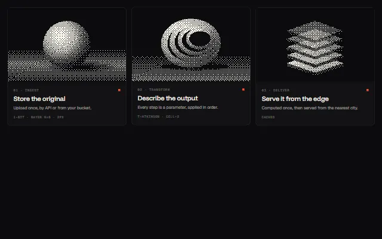</a><br><a href="https://viberdy.dev/library/dither-develop-card?ref=github"><b>Dither Develop Card</b></a><br><sub>A card whose image prints in cell by cell the first time it is seen, ordered-dithered with CSS alone, with a soft light that follows the pointer through the dither.</sub><br><sub><code>dither-develop-card</code> · <a href="components/dither-develop-card.tsx">code</a> · <a href="prompts/dither-develop-card.md">prompt</a></sub></td><td width="33%" valign="top"><a href="https://viberdy.dev/library/dither-drop-input?ref=github">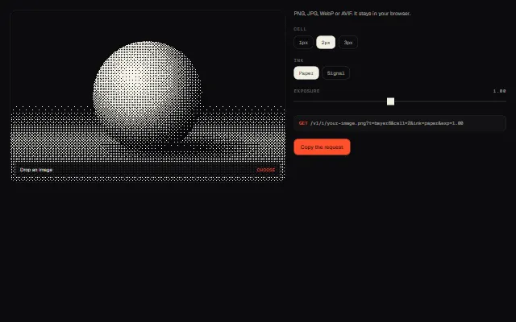</a><br><a href="https://viberdy.dev/library/dither-drop-input?ref=github"><b>Dither Drop Input</b></a><br><sub>Drop an image and see it dithered right there, with CSS alone: choose the cell size and the ink, set the exposure, and the request URL for that output builds as you go; submitting copies it.</sub><br><sub><code>dither-drop-input</code> · <a href="components/dither-drop-input.tsx">code</a> · <a href="prompts/dither-drop-input.md">prompt</a></sub></td></tr>
</table>

<h3 id="editorial">Editorial</h3>

Magazine and poster conventions: display type, rules, mono captions. [Live demos →](https://viberdy.dev/styles/editorial?ref=github)

<table>
<tr><td width="33%" valign="top"><a href="https://viberdy.dev/library/headline-switch-hero?ref=github">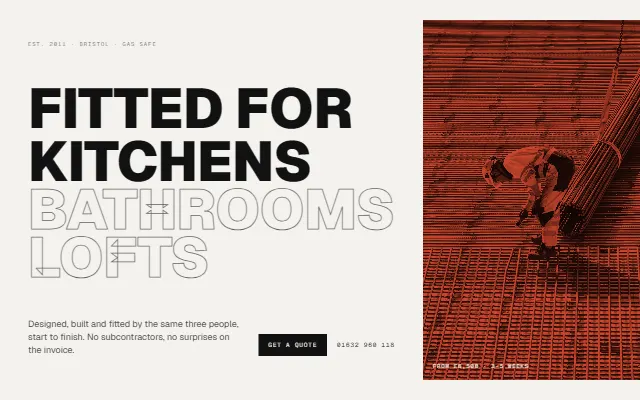</a><br><a href="https://viberdy.dev/library/headline-switch-hero?ref=github"><b>Headline Switch Hero</b></a><br><sub>The second line of the headline is the navigation: KITCHENS / BATHROOMS / LOFTS at headline size, and choosing one swaps the treated photo plate, the copy and the price.</sub><br><sub><code>headline-switch-hero</code> · <a href="components/headline-switch-hero.tsx">code</a> · <a href="prompts/headline-switch-hero.md">prompt</a></sub></td><td width="33%" valign="top"><a href="https://viberdy.dev/library/hours-poster-section?ref=github">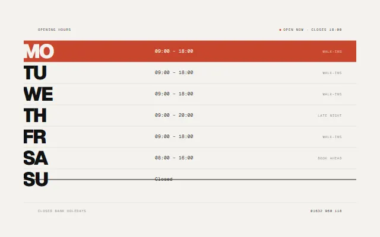</a><br><a href="https://viberdy.dev/library/hours-poster-section?ref=github"><b>Hours Poster Section</b></a><br><sub>Opening hours set as a poster — days hanging off the edge, closed rows struck through, today banded in the one accent — with an open/closed line on the shop's clock.</sub><br><sub><code>hours-poster-section</code> · <a href="components/hours-poster-section.tsx">code</a> · <a href="prompts/hours-poster-section.md">prompt</a></sub></td><td width="33%" valign="top"><a href="https://viberdy.dev/library/marker-highlight-text?ref=github">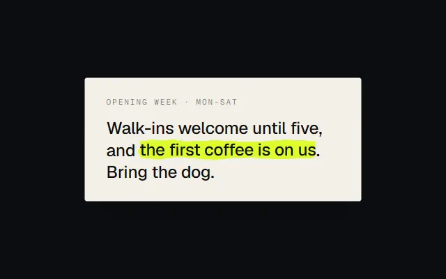</a><br><a href="https://viberdy.dev/library/marker-highlight-text?ref=github"><b>Marker Highlight Text</b></a><br><sub>A felt-tip highlighter stroke with a ragged edge that draws itself behind a phrase when it scrolls into view.</sub><br><sub><code>marker-highlight-text</code> · <a href="components/marker-highlight-text.tsx">code</a> · <a href="prompts/marker-highlight-text.md">prompt</a></sub></td></tr>
</table>

<h3 id="glassmorphism">Glassmorphism</h3>

Translucent frosted and refractive panels, rim light and layered depth. [Live demos →](https://viberdy.dev/styles/glassmorphism?ref=github)

<table>
<tr><td width="33%" valign="top"><a href="https://viberdy.dev/library/glass-etch-text?ref=github">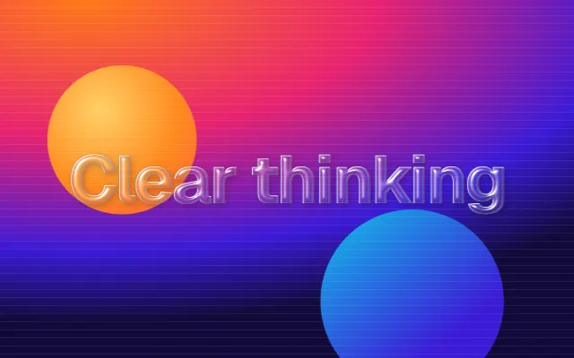</a><br><a href="https://viberdy.dev/library/glass-etch-text?ref=github"><b>Glass Etch Text</b></a><br><sub>Real, selectable heading text rendered as glass: a lit bevel, a graduated rim and a hairline colour fringe, raised or etched in.</sub><br><sub><code>glass-etch-text</code> · <a href="components/glass-etch-text.tsx">code</a> · <a href="prompts/glass-etch-text.md">prompt</a></sub></td><td width="33%" valign="top"><a href="https://viberdy.dev/library/glass-focus-field?ref=github">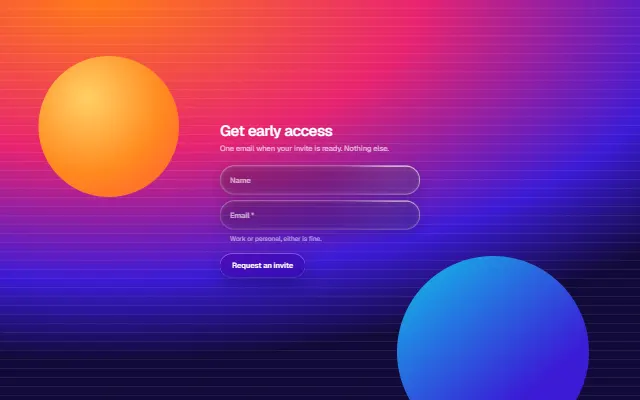</a><br><a href="https://viberdy.dev/library/glass-focus-field?ref=github"><b>Glass Focus Field</b></a><br><sub>A liquid-glass input whose rim notices the pointer before focus, thickens outward from where you click, ripples from the caret with every keystroke and clouds its frost on an error.</sub><br><sub><code>glass-focus-field</code> · <a href="components/glass-focus-field.tsx">code</a> · <a href="prompts/glass-focus-field.md">prompt</a></sub></td><td width="33%" valign="top"><a href="https://viberdy.dev/library/glass-morph-popover?ref=github">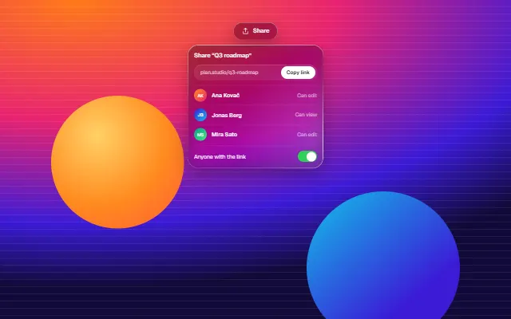</a><br><a href="https://viberdy.dev/library/glass-morph-popover?ref=github"><b>Glass Morph Popover</b></a><br><sub>A popover that grows out of its button as a drop of liquid glass, stretches toward its place and settles flat, then drains back the same way.</sub><br><sub><code>glass-morph-popover</code> · <a href="components/glass-morph-popover.tsx">code</a> · <a href="prompts/glass-morph-popover.md">prompt</a></sub></td></tr>
<tr><td width="33%" valign="top"><a href="https://viberdy.dev/library/glass-tint-footer?ref=github">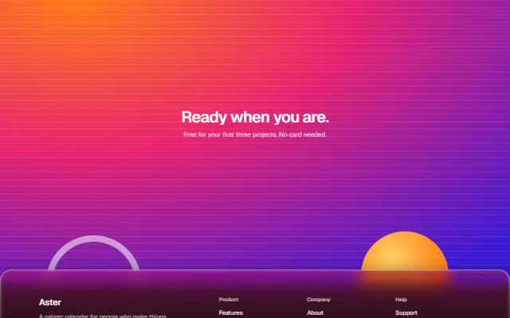</a><br><a href="https://viberdy.dev/library/glass-tint-footer?ref=github"><b>Glass Tint Footer</b></a><br><sub>A liquid-glass footer slab that rises over the section above as you scroll in, its meniscus edge sloshing on fast scrolls, with a pointer light, a droplet gliding between links and frost re-tinted to that section.</sub><br><sub><code>glass-tint-footer</code> · <a href="components/glass-tint-footer.tsx">code</a> · <a href="prompts/glass-tint-footer.md">prompt</a></sub></td><td width="33%" valign="top"><a href="https://viberdy.dev/library/liquid-glass-button?ref=github">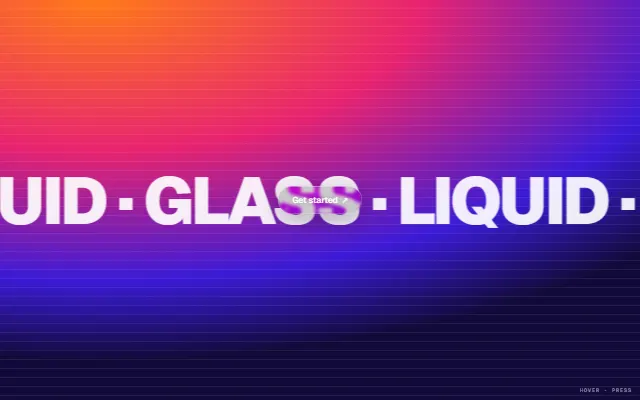</a><br><a href="https://viberdy.dev/library/liquid-glass-button?ref=github"><b>Liquid Glass Button</b></a><br><sub>A pill of liquid glass that bends what is behind it: real refraction at the rim, a rim and sheen lit by your pointer, and a gel-like press.</sub><br><sub><code>liquid-glass-button</code> · <a href="components/liquid-glass-button.tsx">code</a> · <a href="prompts/liquid-glass-button.md">prompt</a></sub></td><td width="33%" valign="top"><a href="https://viberdy.dev/library/liquid-glass-switch?ref=github">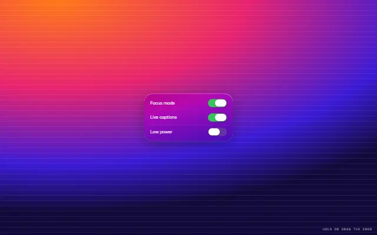</a><br><a href="https://viberdy.dev/library/liquid-glass-switch?ref=github"><b>Liquid Glass Switch</b></a><br><sub>A toggle whose knob swells into a clear glass lens while you hold or drag it, magnifying the track beneath, then springs home solid.</sub><br><sub><code>liquid-glass-switch</code> · <a href="components/liquid-glass-switch.tsx">code</a> · <a href="prompts/liquid-glass-switch.md">prompt</a></sub></td></tr>
</table>

<h3 id="kinetic-type">Kinetic Type</h3>

Type as the interface: variable-font axes and letters that move, answer and rebuild. [Live demos →](https://viberdy.dev/styles/kinetic-type?ref=github)

<table>
<tr><td width="33%" valign="top"><a href="https://viberdy.dev/library/axis-flow-nav?ref=github">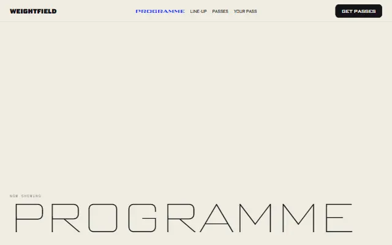</a><br><a href="https://viberdy.dev/library/axis-flow-nav?ref=github"><b>Axis Flow Nav</b></a><br><sub>A nav whose links are one flush line: the active link is loud, the rest condensed, and choosing another makes the width flow to it letter by letter while the nav never changes size.</sub><br><sub><code>axis-flow-nav</code> · <a href="components/axis-flow-nav.tsx">code</a> · <a href="prompts/axis-flow-nav.md">prompt</a></sub></td><td width="33%" valign="top"><a href="https://viberdy.dev/library/axis-press-button?ref=github">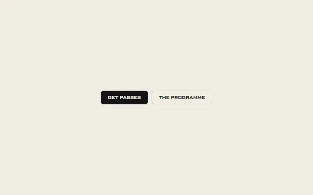</a><br><a href="https://viberdy.dev/library/axis-press-button?ref=github"><b>Axis Press Button</b></a><br><sub>A button whose label is the control: letters under the pointer swell heavier and wider while the rest condense, so the button never changes size, and a press clenches every letter and springs it back.</sub><br><sub><code>axis-press-button</code> · <a href="components/axis-press-button.tsx">code</a> · <a href="prompts/axis-press-button.md">prompt</a></sub></td><td width="33%" valign="top"><a href="https://viberdy.dev/library/axis-scrub-heading?ref=github">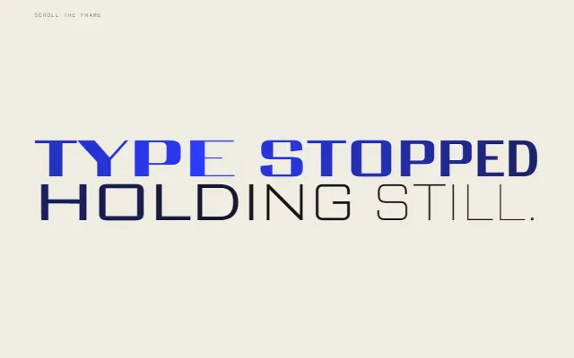</a><br><a href="https://viberdy.dev/library/axis-scrub-heading?ref=github"><b>Axis Scrub Heading</b></a><br><sub>A heading written by the scroll: as it rises through the view a wave runs through its letters from hairline to a loud accent peak to its set weight, and scrolling back unwrites it.</sub><br><sub><code>axis-scrub-heading</code> · <a href="components/axis-scrub-heading.tsx">code</a> · <a href="prompts/axis-scrub-heading.md">prompt</a></sub></td></tr>
<tr><td width="33%" valign="top"><a href="https://viberdy.dev/library/axis-session-card?ref=github">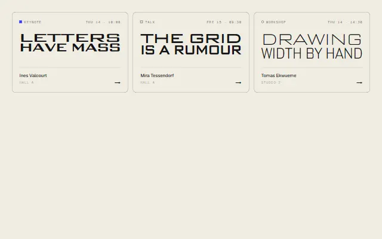</a><br><a href="https://viberdy.dev/library/axis-session-card?ref=github"><b>Axis Session Card</b></a><br><sub>A programme card whose title is set by what the session is: a workshop quiet and narrow, a talk set, a keynote loud and wide, so a grid reads as a legend; hover pushes it further into its own kind.</sub><br><sub><code>axis-session-card</code> · <a href="components/axis-session-card.tsx">code</a> · <a href="prompts/axis-session-card.md">prompt</a></sub></td><td width="33%" valign="top"><a href="https://viberdy.dev/library/glyph-axis-stagger?ref=github">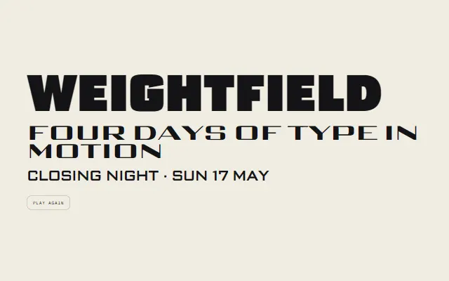</a><br><a href="https://viberdy.dev/library/glyph-axis-stagger?ref=github"><b>Glyph Axis Stagger</b></a><br><sub>The kit's rebuild as a primitive: split any text into letters and spring each one between two settings of the face, a fixed delay apart, in the order you choose, on view, on hover or on command.</sub><br><sub><code>glyph-axis-stagger</code> · <a href="components/glyph-axis-stagger.tsx">code</a> · <a href="prompts/glyph-axis-stagger.md">prompt</a></sub></td><td width="33%" valign="top"><a href="https://viberdy.dev/library/name-badge-input?ref=github">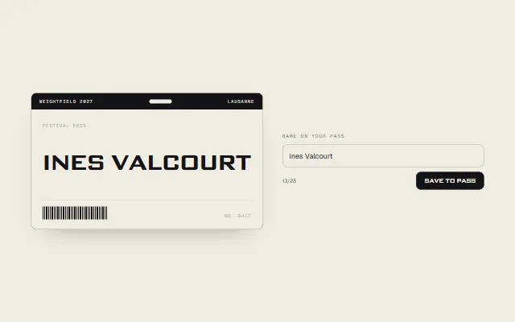</a><br><a href="https://viberdy.dev/library/name-badge-input?ref=github"><b>Name Badge Input</b></a><br><sub>A name field that sets your name on a pass as you type: each new letter lands loud in the accent and springs into place, a deleted one collapses to a hairline, and the name stays flush across the badge.</sub><br><sub><code>name-badge-input</code> · <a href="components/name-badge-input.tsx">code</a> · <a href="prompts/name-badge-input.md">prompt</a></sub></td></tr>
<tr><td width="33%" valign="top"><a href="https://viberdy.dev/library/weight-wave-text?ref=github">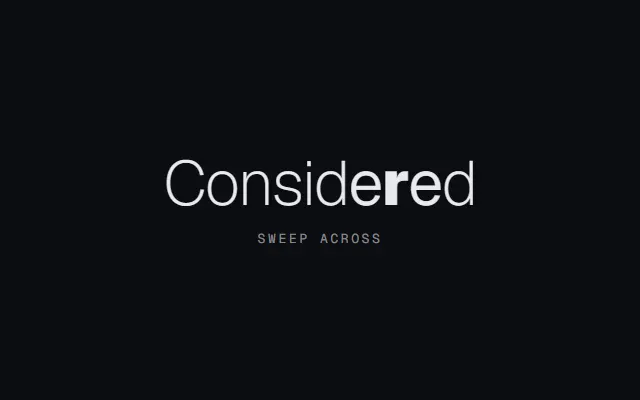</a><br><a href="https://viberdy.dev/library/weight-wave-text?ref=github"><b>Weight Wave Text</b></a><br><sub>Per-character variable font weight that swells around the pointer and drifts when idle.</sub><br><sub><code>weight-wave-text</code> · <a href="components/weight-wave-text.tsx">code</a> · <a href="prompts/weight-wave-text.md">prompt</a></sub></td></tr>
</table>

<h3 id="liquid-chrome">Liquid Chrome</h3>

Molten chrome, iridescent foil and dispersion glass: surfaces that ripple and shine. [Live demos →](https://viberdy.dev/styles/liquid-chrome?ref=github)

<table>
<tr><td width="33%" valign="top"><a href="https://viberdy.dev/library/chrome-pill-button?ref=github">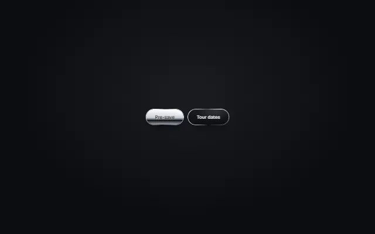</a><br><a href="https://viberdy.dev/library/chrome-pill-button?ref=github"><b>Chrome Pill Button</b></a><br><sub>A pill of polished chrome that reflects a lit room: its horizon, softbox glint and bezel light turn toward the pointer, and a press squashes it and drops a ring into the surface.</sub><br><sub><code>chrome-pill-button</code> · <a href="components/chrome-pill-button.tsx">code</a> · <a href="prompts/chrome-pill-button.md">prompt</a></sub></td><td width="33%" valign="top"><a href="https://viberdy.dev/library/chrome-pour-reveal?ref=github">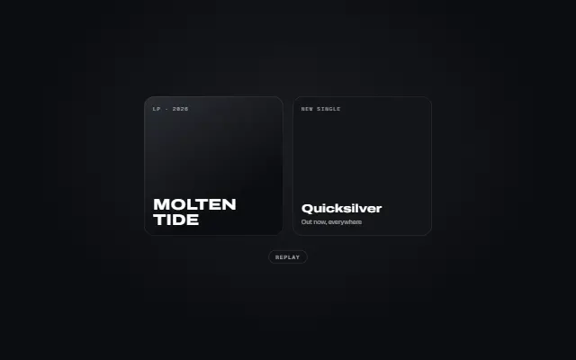</a><br><a href="https://viberdy.dev/library/chrome-pour-reveal?ref=github"><b>Chrome Pour Reveal</b></a><br><sub>A reveal that casts its content in liquid chrome: molten metal pours down over the space with drips racing ahead and merging into the sheet, then cools away from the top behind a hot seam of light.</sub><br><sub><code>chrome-pour-reveal</code> · <a href="components/chrome-pour-reveal.tsx">code</a> · <a href="prompts/chrome-pour-reveal.md">prompt</a></sub></td><td width="33%" valign="top"><a href="https://viberdy.dev/library/chrome-rim-input?ref=github">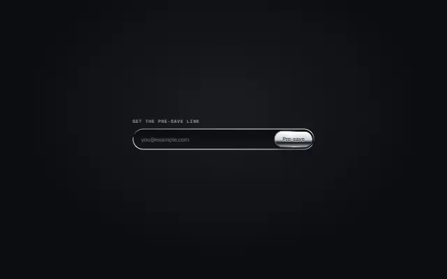</a><br><a href="https://viberdy.dev/library/chrome-rim-input?ref=github"><b>Chrome Rim Input</b></a><br><sub>An email field in a pill with a chrome rim: each keystroke sends two ripples of light racing round the rim from the caret, a light laps it while sending, and success pours the pill into a round chrome drop with a check.</sub><br><sub><code>chrome-rim-input</code> · <a href="components/chrome-rim-input.tsx">code</a> · <a href="prompts/chrome-rim-input.md">prompt</a></sub></td></tr>
<tr><td width="33%" valign="top"><a href="https://viberdy.dev/library/holo-ticket-card?ref=github">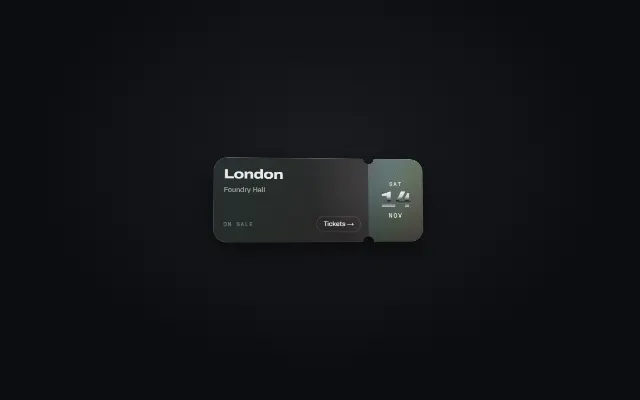</a><br><a href="https://viberdy.dev/library/holo-ticket-card?ref=github"><b>Holo Ticket Card</b></a><br><sub>A tour date as a notched, perforated ticket whose stub carries the date in chrome numerals on a strip of holographic foil; it tilts toward the pointer while the foil's colour slides and a glare follows.</sub><br><sub><code>holo-ticket-card</code> · <a href="components/holo-ticket-card.tsx">code</a> · <a href="prompts/holo-ticket-card.md">prompt</a></sub></td><td width="33%" valign="top"><a href="https://viberdy.dev/library/mercury-pour-nav?ref=github">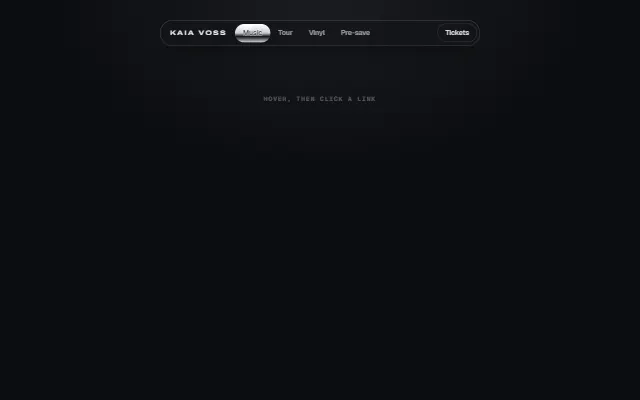</a><br><a href="https://viberdy.dev/library/mercury-pour-nav?ref=github"><b>Mercury Pour Nav</b></a><br><sub>A floating nav whose current-link indicator is a capsule of mercury on two springs: it stretches thin as it pours to the next link, snaps back round, reaches toward the link you hover, and turns the labels it covers dark.</sub><br><sub><code>mercury-pour-nav</code> · <a href="components/mercury-pour-nav.tsx">code</a> · <a href="prompts/mercury-pour-nav.md">prompt</a></sub></td><td width="33%" valign="top"><a href="https://viberdy.dev/library/pour-fill-heading?ref=github">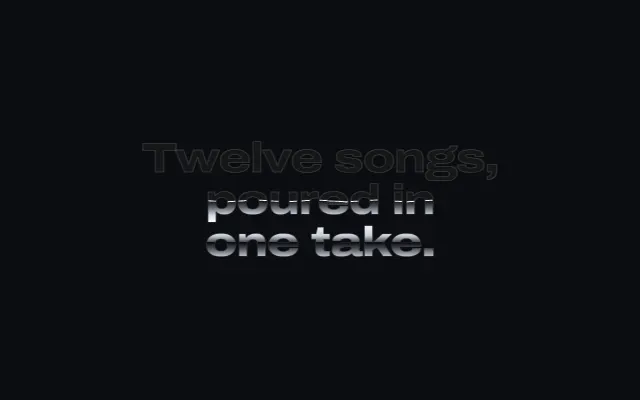</a><br><a href="https://viberdy.dev/library/pour-fill-heading?ref=github"><b>Pour Fill Heading</b></a><br><sub>A heading that starts as an empty mould and fills with liquid chrome as it scrolls into view, its surface a meniscus with a hot line of light that sloshes with scroll speed and settles.</sub><br><sub><code>pour-fill-heading</code> · <a href="components/pour-fill-heading.tsx">code</a> · <a href="prompts/pour-fill-heading.md">prompt</a></sub></td></tr>
</table>

<h3 id="modern-minimal">Modern Minimal</h3>

Light, quiet layouts where restraint is earned by motion: scroll reveals, scrubs, view transitions. [Live demos →](https://viberdy.dev/styles/modern-minimal?ref=github)

<table>
<tr><td width="33%" valign="top"><a href="https://viberdy.dev/library/hairline-morph-nav?ref=github">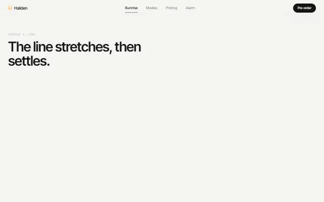</a><br><a href="https://viberdy.dev/library/hairline-morph-nav?ref=github"><b>Hairline Morph Nav</b></a><br><sub>A nav whose single hairline stretches toward the next link and settles under it: its leading edge runs ahead on a quick spring while its trailing edge follows on a slower one, and the active label steps up a weight without shifting.</sub><br><sub><code>hairline-morph-nav</code> · <a href="components/hairline-morph-nav.tsx">code</a> · <a href="prompts/hairline-morph-nav.md">prompt</a></sub></td><td width="33%" valign="top"><a href="https://viberdy.dev/library/light-lift-card?ref=github">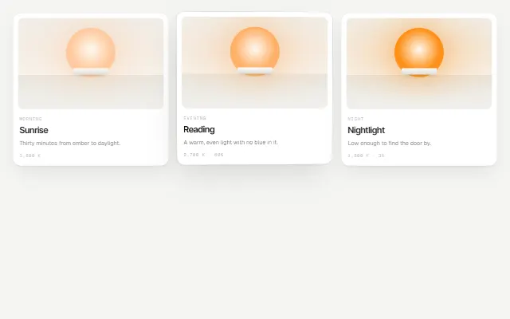</a><br><a href="https://viberdy.dev/library/light-lift-card?ref=github"><b>Light Lift Card</b></a><br><sub>A card that lifts toward the pointer with shadows that behave like light: a two-degree tilt, an ambient shadow that widens and drifts away from the side that rose, a contact line that thins, and a plate of light at a colour temperature.</sub><br><sub><code>light-lift-card</code> · <a href="components/light-lift-card.tsx">code</a> · <a href="prompts/light-lift-card.md">prompt</a></sub></td><td width="33%" valign="top"><a href="https://viberdy.dev/library/scrub-mask-reveal?ref=github">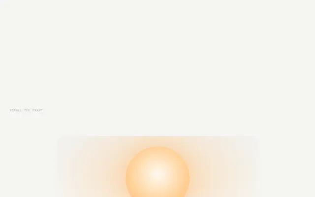</a><br><a href="https://viberdy.dev/library/scrub-mask-reveal?ref=github"><b>Scrub Mask Reveal</b></a><br><sub>A plate that opens exactly with the scroll: its rounded frame widens from a fifth in on each side to full while the picture inside eases the other way so it seems to stay still, bound with no easing, with a hairline that fills.</sub><br><sub><code>scrub-mask-reveal</code> · <a href="components/scrub-mask-reveal.tsx">code</a> · <a href="prompts/scrub-mask-reveal.md">prompt</a></sub></td></tr>
<tr><td width="33%" valign="top"><a href="https://viberdy.dev/library/sundial-shadow-heading?ref=github">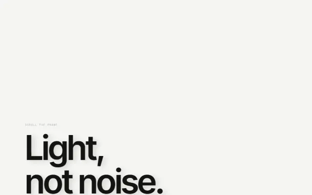</a><br><a href="https://viberdy.dev/library/sundial-shadow-heading?ref=github"><b>Sundial Shadow Heading</b></a><br><sub>A heading whose letters cast soft shadows that swing like a sundial as the page scrolls: the sun crosses with the scroll, the long shadows turn from right to left, and a faint warm band of light slides across the ink.</sub><br><sub><code>sundial-shadow-heading</code> · <a href="components/sundial-shadow-heading.tsx">code</a> · <a href="prompts/sundial-shadow-heading.md">prompt</a></sub></td><td width="33%" valign="top"><a href="https://viberdy.dev/library/wake-time-wheel?ref=github">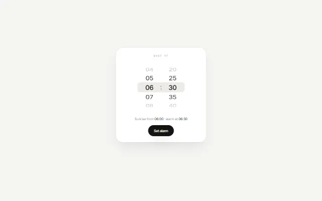</a><br><a href="https://viberdy.dev/library/wake-time-wheel?ref=github"><b>Wake Time Wheel</b></a><br><sub>Set the alarm on a pair of wheels: hours and minutes are snap-scrolling columns with momentum whose rows turn away in perspective around a lens, each a keyboard spinbutton, with the time the sunrise starts beneath.</sub><br><sub><code>wake-time-wheel</code> · <a href="components/wake-time-wheel.tsx">code</a> · <a href="prompts/wake-time-wheel.md">prompt</a></sub></td><td width="33%" valign="top"><a href="https://viberdy.dev/library/weight-press-button?ref=github">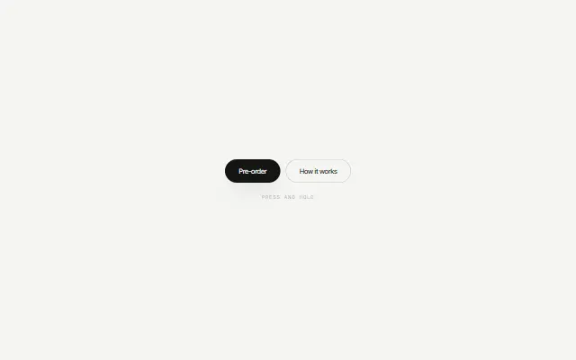</a><br><a href="https://viberdy.dev/library/weight-press-button?ref=github"><b>Weight Press Button</b></a><br><sub>A button whose press you can see in its type: hover and the label thickens as the button lifts; press and it goes bold under your finger while the button sinks and its shadow collapses to the contact line, then springs back.</sub><br><sub><code>weight-press-button</code> · <a href="components/weight-press-button.tsx">code</a> · <a href="prompts/weight-press-button.md">prompt</a></sub></td></tr>
</table>

<h3 id="spatial-3d">Spatial 3D</h3>

Real-time 3D objects and sculpted forms you can orbit, with depth-aware UI around them. [Live demos →](https://viberdy.dev/styles/spatial-3d?ref=github)

<table>
<tr><td width="33%" valign="top"><a href="https://viberdy.dev/library/card-carousel-3d?ref=github">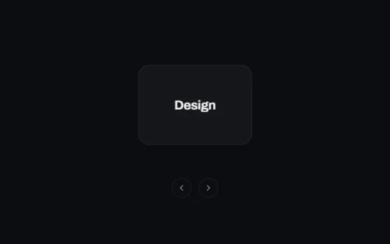</a><br><a href="https://viberdy.dev/library/card-carousel-3d?ref=github"><b>3D Card Carousel</b></a><br><sub>Cards mounted on a rotating 3D ring — the active one faces forward, others recede.</sub><br><sub><code>card-carousel-3d</code> · <a href="components/card-carousel-3d.tsx">code</a> · <a href="prompts/card-carousel-3d.md">prompt</a></sub></td><td width="33%" valign="top"><a href="https://viberdy.dev/library/anamorphic-heading?ref=github">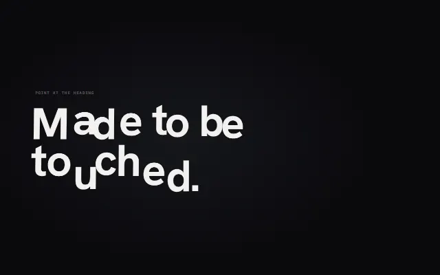</a><br><a href="https://viberdy.dev/library/anamorphic-heading?ref=github"><b>Anamorphic Heading</b></a><br><sub>A heading that only reads from the right angle: its letters stand at different depths, scaled so they line up from straight ahead, and the view swings round to square as it scrolls in.</sub><br><sub><code>anamorphic-heading</code> · <a href="components/anamorphic-heading.tsx">code</a> · <a href="prompts/anamorphic-heading.md">prompt</a></sub></td><td width="33%" valign="top"><a href="https://viberdy.dev/library/assemble-reveal?ref=github">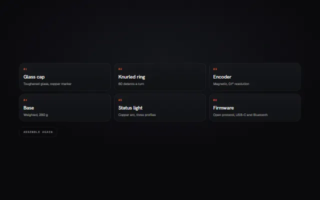</a><br><a href="https://viberdy.dev/library/assemble-reveal?ref=github"><b>Assemble Reveal</b></a><br><sub>A reveal where parts assemble in 3D: each item starts at its own offset and turn deep in perspective and flies home on a spring with a slight overshoot, one after another, as it comes into view.</sub><br><sub><code>assemble-reveal</code> · <a href="components/assemble-reveal.tsx">code</a> · <a href="prompts/assemble-reveal.md">prompt</a></sub></td></tr>
<tr><td width="33%" valign="top"><a href="https://viberdy.dev/library/curved-rail-nav?ref=github">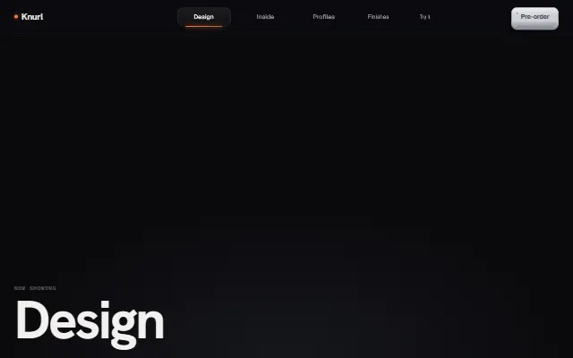</a><br><a href="https://viberdy.dev/library/curved-rail-nav?ref=github"><b>Curved Rail Nav</b></a><br><sub>A nav whose links ride a shallow cylinder in real perspective: the active link stands forward and underlit in copper, and choosing another turns the rail toward it on a spring.</sub><br><sub><code>curved-rail-nav</code> · <a href="components/curved-rail-nav.tsx">code</a> · <a href="prompts/curved-rail-nav.md">prompt</a></sub></td><td width="33%" valign="top"><a href="https://viberdy.dev/library/detent-dial-input?ref=github">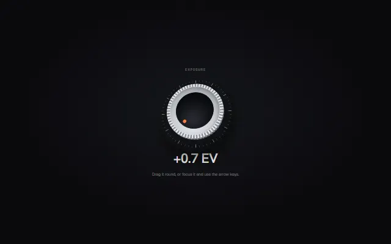</a><br><a href="https://viberdy.dev/library/detent-dial-input?ref=github"><b>Detent Dial Input</b></a><br><sub>A number set by turning a CSS-3D dial: drag round it and it steps through detents, springing onto each while its copper marker ticks; a real slider with full keyboard control that submits in a form.</sub><br><sub><code>detent-dial-input</code> · <a href="components/detent-dial-input.tsx">code</a> · <a href="prompts/detent-dial-input.md">prompt</a></sub></td><td width="33%" valign="top"><a href="https://viberdy.dev/library/extruded-spec-card?ref=github">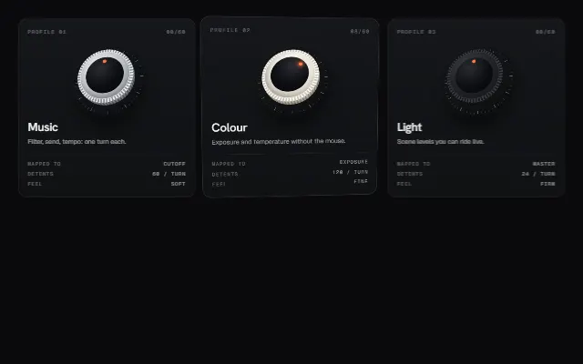</a><br><a href="https://viberdy.dev/library/extruded-spec-card?ref=github"><b>Extruded Spec Card</b></a><br><sub>A card holding a small machined dial built in CSS 3D: the card tilts toward the pointer and the dial turns to follow it one detent at a time, its copper marker lit, over a data-plate of specs.</sub><br><sub><code>extruded-spec-card</code> · <a href="components/extruded-spec-card.tsx">code</a> · <a href="prompts/extruded-spec-card.md">prompt</a></sub></td></tr>
<tr><td width="33%" valign="top"><a href="https://viberdy.dev/library/keycap-button?ref=github">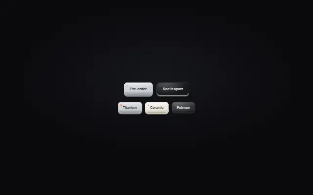</a><br><a href="https://viberdy.dev/library/keycap-button?ref=github"><b>Keycap Button</b></a><br><sub>A button machined like a keycap: a press drops the cap 6px as its skirt collapses, release springs it back past rest, a specular follows the pointer and a copper status light glows while it's held.</sub><br><sub><code>keycap-button</code> · <a href="components/keycap-button.tsx">code</a> · <a href="prompts/keycap-button.md">prompt</a></sub></td></tr>
</table>

<h3 id="tactile-maximalism">Tactile Maximalism</h3>

One oversized headline, one loud accent, grain and squishy spring physics: loud but composed. [Live demos →](https://viberdy.dev/styles/tactile-maximalism?ref=github)

<table>
<tr><td width="33%" valign="top"><a href="https://viberdy.dev/library/gummy-type-input?ref=github">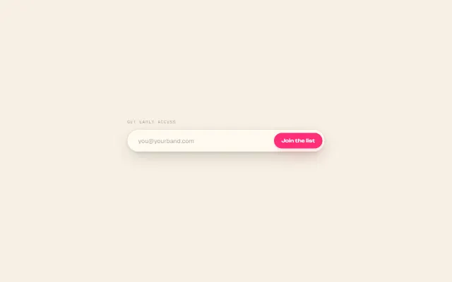</a><br><a href="https://viberdy.dev/library/gummy-type-input?ref=github"><b>Gummy Type Input</b></a><br><sub>An email field whose letters drop in and land: each typed letter falls from a little above, stretched as it falls and squashed as it lands, while the real input underneath keeps the caret, selection and autofill.</sub><br><sub><code>gummy-type-input</code> · <a href="components/gummy-type-input.tsx">code</a> · <a href="prompts/gummy-type-input.md">prompt</a></sub></td><td width="33%" valign="top"><a href="https://viberdy.dev/library/squash-press-button?ref=github">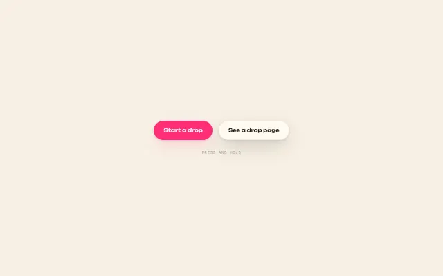</a><br><a href="https://viberdy.dev/library/squash-press-button?ref=github"><b>Squash Press Button</b></a><br><sub>A pill that squashes under your finger and pops back: it sinks onto its base where you press, deeper the longer you hold, keeps its area as it squashes, and springs back with one overshoot while its tinted shadows collapse and return.</sub><br><sub><code>squash-press-button</code> · <a href="components/squash-press-button.tsx">code</a> · <a href="prompts/squash-press-button.md">prompt</a></sub></td><td width="33%" valign="top"><a href="https://viberdy.dev/library/squish-flip?ref=github">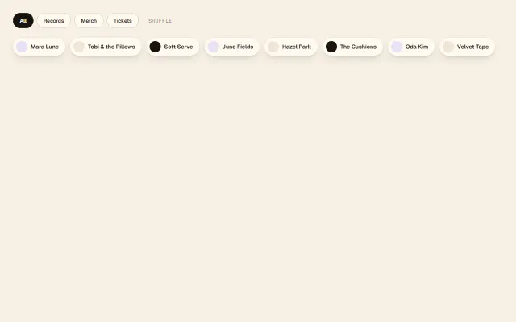</a><br><a href="https://viberdy.dev/library/squish-flip?ref=github"><b>Squish Flip</b></a><br><sub>A list whose items squash and stretch as they move: reorder, filter or add and each item travels to its new place stretched along its path by its speed, squashes as it lands, and settles; new items pop in.</sub><br><sub><code>squish-flip</code> · <a href="components/squish-flip.tsx">code</a> · <a href="prompts/squish-flip.md">prompt</a></sub></td></tr>
<tr><td width="33%" valign="top"><a href="https://viberdy.dev/library/squish-letter-heading?ref=github">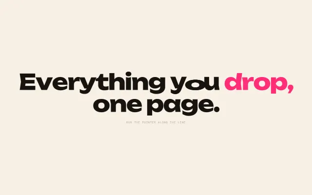</a><br><a href="https://viberdy.dev/library/squish-letter-heading?ref=github"><b>Squish Letter Heading</b></a><br><sub>A heading whose letters squash under the pointer and push their neighbours up: each letter keeps its area as it squashes, springs back with one overshoot, and the line ripples behind the pointer before settling to crisp type.</sub><br><sub><code>squish-letter-heading</code> · <a href="components/squish-letter-heading.tsx">code</a> · <a href="prompts/squish-letter-heading.md">prompt</a></sub></td><td width="33%" valign="top"><a href="https://viberdy.dev/library/taffy-pill-nav?ref=github">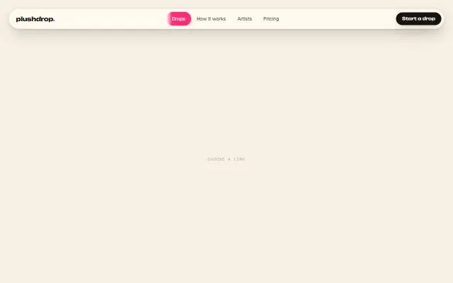</a><br><a href="https://viberdy.dev/library/taffy-pill-nav?ref=github"><b>Taffy Pill Nav</b></a><br><sub>A floating pill nav whose bubblegum marker stretches like taffy to the link you choose: long and thin in flight, short and fat as it lands, with the labels turning paper exactly where it covers them.</sub><br><sub><code>taffy-pill-nav</code> · <a href="components/taffy-pill-nav.tsx">code</a> · <a href="prompts/taffy-pill-nav.md">prompt</a></sub></td><td width="33%" valign="top"><a href="https://viberdy.dev/library/wobble-drop-card?ref=github">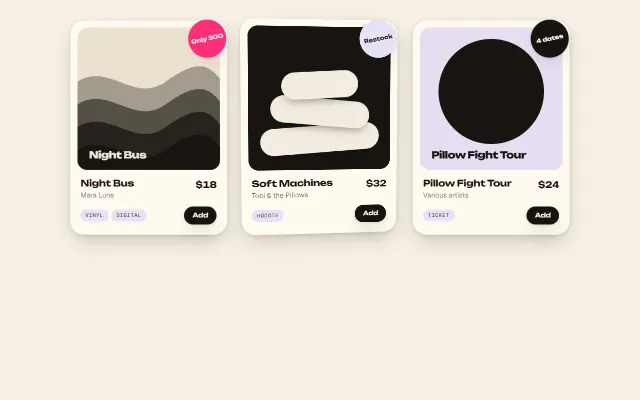</a><br><a href="https://viberdy.dev/library/wobble-drop-card?ref=github"><b>Wobble Drop Card</b></a><br><sub>A release card that leans toward the pointer on a soft spring while the sticker on its corner follows through, swinging the other way and jiggling to a stop; press it and the card squashes onto its base and pops back.</sub><br><sub><code>wobble-drop-card</code> · <a href="components/wobble-drop-card.tsx">code</a> · <a href="prompts/wobble-drop-card.md">prompt</a></sub></td></tr>
</table>

<h3 id="essentials">Essentials</h3>

Everyday interface pieces with a motion detail worth stealing: buttons, inputs, toasts, counters, carousels.

<table>
<tr><td width="33%" valign="top"><a href="https://viberdy.dev/library/flip-card?ref=github">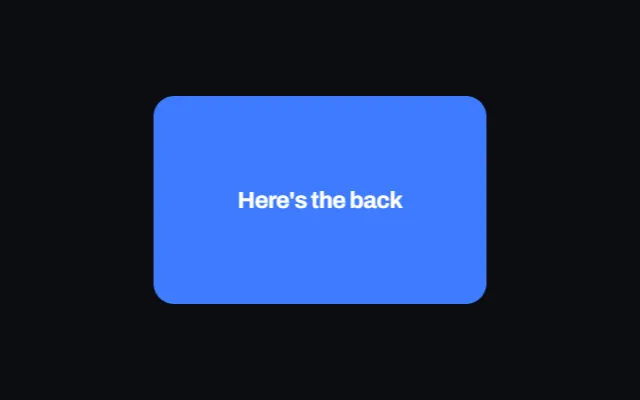</a><br><a href="https://viberdy.dev/library/flip-card?ref=github"><b>3D Flip Card</b></a><br><sub>A card that flips on a real Y-axis rotation to reveal a back face.</sub><br><sub><code>flip-card</code> · <a href="components/flip-card.tsx">code</a> · <a href="prompts/flip-card.md">prompt</a></sub></td><td width="33%" valign="top"><a href="https://viberdy.dev/library/animated-checkbox?ref=github">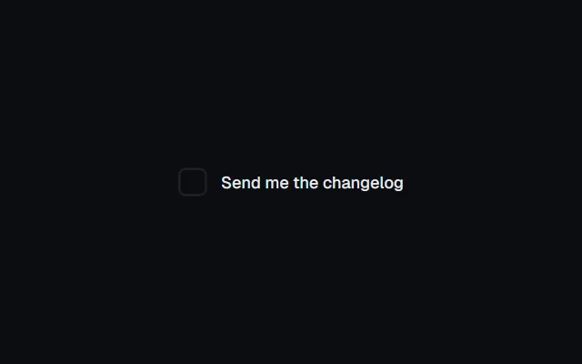</a><br><a href="https://viberdy.dev/library/animated-checkbox?ref=github"><b>Animated Checkbox</b></a><br><sub>A checkbox whose checkmark draws itself in as a real SVG path animation.</sub><br><sub><code>animated-checkbox</code> · <a href="components/animated-checkbox.tsx">code</a> · <a href="prompts/animated-checkbox.md">prompt</a></sub></td><td width="33%" valign="top"><a href="https://viberdy.dev/library/gradient-border-beam?ref=github">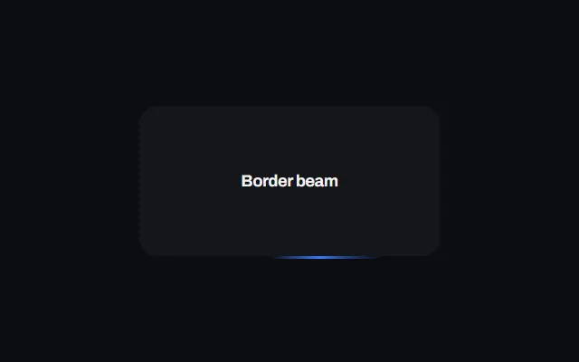</a><br><a href="https://viberdy.dev/library/gradient-border-beam?ref=github"><b>Animated Gradient Border Beam</b></a><br><sub>A light beam that continuously travels around a card's border.</sub><br><sub><code>gradient-border-beam</code> · <a href="components/gradient-border-beam.tsx">code</a> · <a href="prompts/gradient-border-beam.md">prompt</a></sub></td></tr>
<tr><td width="33%" valign="top"><a href="https://viberdy.dev/library/animated-stat-grid?ref=github">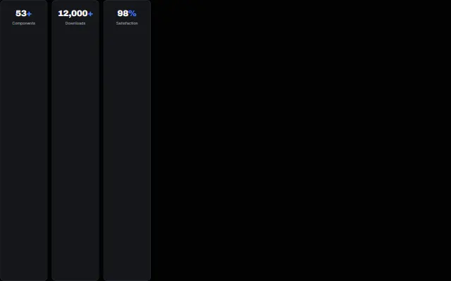</a><br><a href="https://viberdy.dev/library/animated-stat-grid?ref=github"><b>Animated Stat Grid</b></a><br><sub>A row of stat counters that count up together the moment they scroll into view.</sub><br><sub><code>animated-stat-grid</code> · <a href="components/animated-stat-grid.tsx">code</a> · <a href="prompts/animated-stat-grid.md">prompt</a></sub></td><td width="33%" valign="top"><a href="https://viberdy.dev/library/animated-tabs-indicator?ref=github">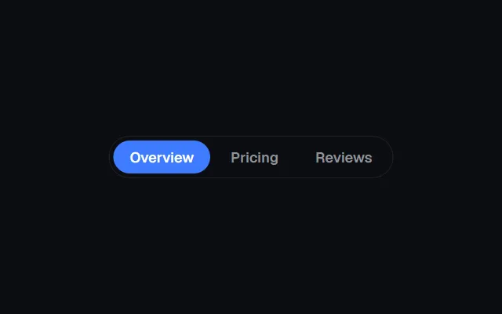</a><br><a href="https://viberdy.dev/library/animated-tabs-indicator?ref=github"><b>Animated Tabs Indicator</b></a><br><sub>A tab row where the active-state highlight slides between tabs instead of popping.</sub><br><sub><code>animated-tabs-indicator</code> · <a href="components/animated-tabs-indicator.tsx">code</a> · <a href="prompts/animated-tabs-indicator.md">prompt</a></sub></td><td width="33%" valign="top"><a href="https://viberdy.dev/library/ascii-halftone-canvas?ref=github">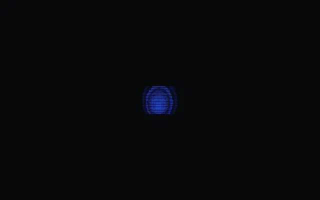</a><br><a href="https://viberdy.dev/library/ascii-halftone-canvas?ref=github"><b>ASCII Halftone Canvas</b></a><br><sub>Turns any canvas drawing into live ASCII art, sampled one pixel per glyph.</sub><br><sub><code>ascii-halftone-canvas</code> · <a href="components/ascii-halftone-canvas.tsx">code</a> · <a href="prompts/ascii-halftone-canvas.md">prompt</a></sub></td></tr>
<tr><td width="33%" valign="top"><a href="https://viberdy.dev/library/audio-wave-visualizer?ref=github">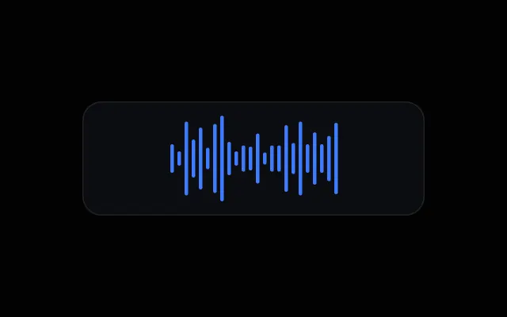</a><br><a href="https://viberdy.dev/library/audio-wave-visualizer?ref=github"><b>Audio Wave Visualizer</b></a><br><sub>A bouncing equalizer bar animation for audio/podcast/music UI.</sub><br><sub><code>audio-wave-visualizer</code> · <a href="components/audio-wave-visualizer.tsx">code</a> · <a href="prompts/audio-wave-visualizer.md">prompt</a></sub></td><td width="33%" valign="top"><a href="https://viberdy.dev/library/badge-ping-counter?ref=github">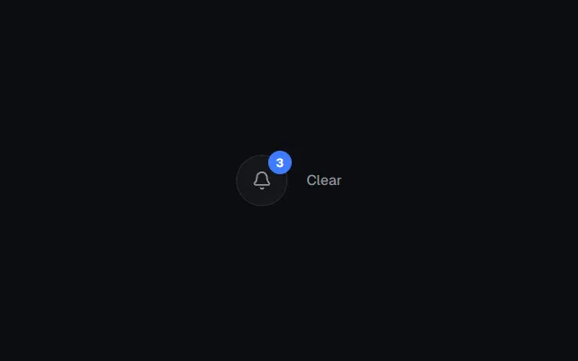</a><br><a href="https://viberdy.dev/library/badge-ping-counter?ref=github"><b>Badge Ping Counter</b></a><br><sub>An icon badge counter that bounces and pings once on every increment.</sub><br><sub><code>badge-ping-counter</code> · <a href="components/badge-ping-counter.tsx">code</a> · <a href="prompts/badge-ping-counter.md">prompt</a></sub></td><td width="33%" valign="top"><a href="https://viberdy.dev/library/progress-ring?ref=github">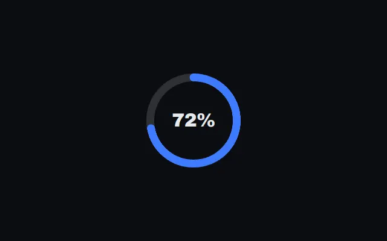</a><br><a href="https://viberdy.dev/library/progress-ring?ref=github"><b>Circular Progress Ring</b></a><br><sub>An SVG progress ring whose fill and centered percentage count up together on scroll into view.</sub><br><sub><code>progress-ring</code> · <a href="components/progress-ring.tsx">code</a> · <a href="prompts/progress-ring.md">prompt</a></sub></td></tr>
<tr><td width="33%" valign="top"><a href="https://viberdy.dev/library/command-palette?ref=github">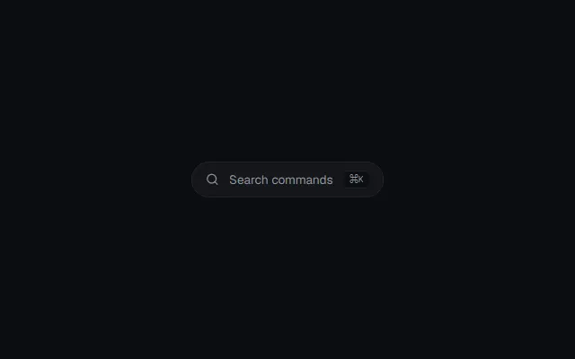</a><br><a href="https://viberdy.dev/library/command-palette?ref=github"><b>Command Palette</b></a><br><sub>A Cmd+K style searchable command menu with a filtered live list.</sub><br><sub><code>command-palette</code> · <a href="components/command-palette.tsx">code</a> · <a href="prompts/command-palette.md">prompt</a></sub></td><td width="33%" valign="top"><a href="https://viberdy.dev/library/concrete-wall-texture?ref=github">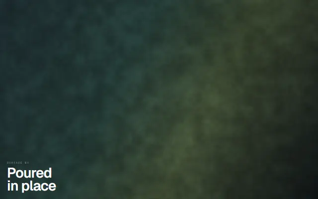</a><br><a href="https://viberdy.dev/library/concrete-wall-texture?ref=github"><b>Concrete Wall Texture</b></a><br><sub>A seamless procedural concrete surface drawn once to canvas and blended over anything.</sub><br><sub><code>concrete-wall-texture</code> · <a href="components/concrete-wall-texture.tsx">code</a> · <a href="prompts/concrete-wall-texture.md">prompt</a></sub></td><td width="33%" valign="top"><a href="https://viberdy.dev/library/confetti-button?ref=github">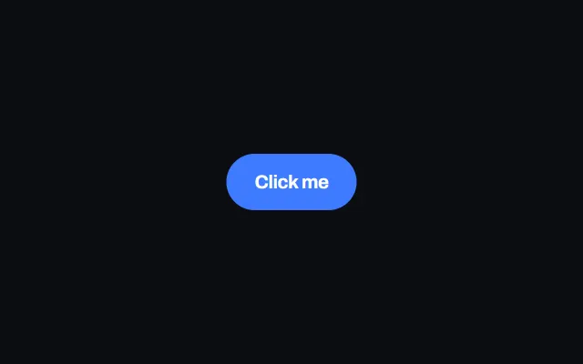</a><br><a href="https://viberdy.dev/library/confetti-button?ref=github"><b>Confetti Burst Button</b></a><br><sub>A button that scatters a quick burst of confetti particles on click.</sub><br><sub><code>confetti-button</code> · <a href="components/confetti-button.tsx">code</a> · <a href="prompts/confetti-button.md">prompt</a></sub></td></tr>
<tr><td width="33%" valign="top"><a href="https://viberdy.dev/library/copy-code-snippet?ref=github">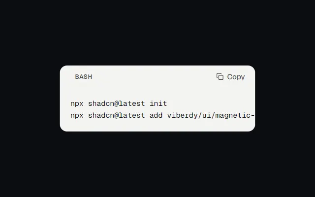</a><br><a href="https://viberdy.dev/library/copy-code-snippet?ref=github"><b>Copy Code Snippet</b></a><br><sub>A dark code block with a one-click copy button that confirms itself.</sub><br><sub><code>copy-code-snippet</code> · <a href="components/copy-code-snippet.tsx">code</a> · <a href="prompts/copy-code-snippet.md">prompt</a></sub></td><td width="33%" valign="top"><a href="https://viberdy.dev/library/cursor-crosshair-readout?ref=github">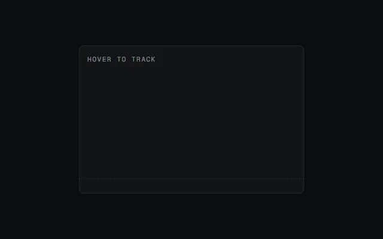</a><br><a href="https://viberdy.dev/library/cursor-crosshair-readout?ref=github"><b>Crosshair Cursor Readout</b></a><br><sub>A drafting-tool crosshair with live X/Y coordinates that trails the pointer.</sub><br><sub><code>cursor-crosshair-readout</code> · <a href="components/cursor-crosshair-readout.tsx">code</a> · <a href="prompts/cursor-crosshair-readout.md">prompt</a></sub></td><td width="33%" valign="top"><a href="https://viberdy.dev/library/crt-scanline-overlay?ref=github">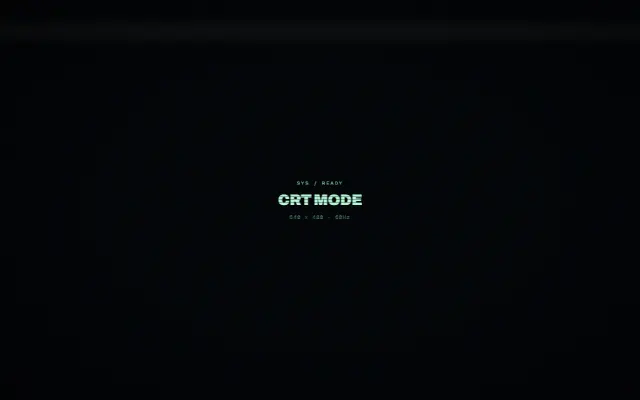</a><br><a href="https://viberdy.dev/library/crt-scanline-overlay?ref=github"><b>CRT Scanline Overlay</b></a><br><sub>Scanlines, aperture grille, rolling refresh and vignette over any content.</sub><br><sub><code>crt-scanline-overlay</code> · <a href="components/crt-scanline-overlay.tsx">code</a> · <a href="prompts/crt-scanline-overlay.md">prompt</a></sub></td></tr>
<tr><td width="33%" valign="top"><a href="https://viberdy.dev/library/cursor-label-follower?ref=github">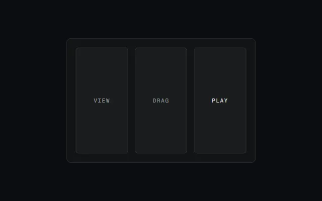</a><br><a href="https://viberdy.dev/library/cursor-label-follower?ref=github"><b>Cursor Label Follower</b></a><br><sub>A contextual chip that trails the pointer and names whatever it is over.</sub><br><sub><code>cursor-label-follower</code> · <a href="components/cursor-label-follower.tsx">code</a> · <a href="prompts/cursor-label-follower.md">prompt</a></sub></td><td width="33%" valign="top"><a href="https://viberdy.dev/library/cursor-lens-magnifier?ref=github">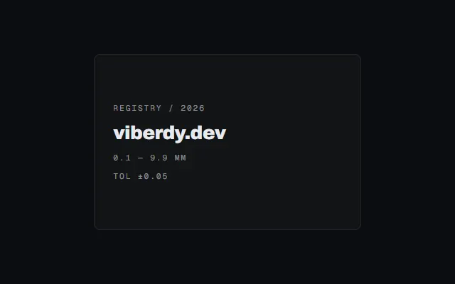</a><br><a href="https://viberdy.dev/library/cursor-lens-magnifier?ref=github"><b>Cursor Lens Magnifier</b></a><br><sub>A glass lens that follows the pointer and magnifies the live DOM beneath it.</sub><br><sub><code>cursor-lens-magnifier</code> · <a href="components/cursor-lens-magnifier.tsx">code</a> · <a href="prompts/cursor-lens-magnifier.md">prompt</a></sub></td><td width="33%" valign="top"><a href="https://viberdy.dev/library/cursor-mask-reveal?ref=github">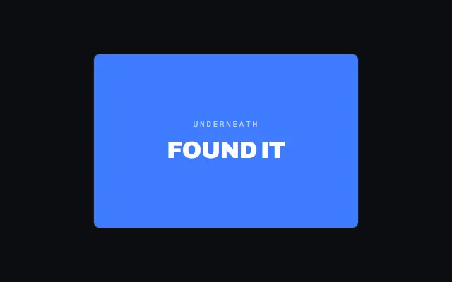</a><br><a href="https://viberdy.dev/library/cursor-mask-reveal?ref=github"><b>Cursor Mask Reveal</b></a><br><sub>The pointer cuts a soft hole through one layer to expose a different one beneath.</sub><br><sub><code>cursor-mask-reveal</code> · <a href="components/cursor-mask-reveal.tsx">code</a> · <a href="prompts/cursor-mask-reveal.md">prompt</a></sub></td></tr>
<tr><td width="33%" valign="top"><a href="https://viberdy.dev/library/drag-inertia-carousel?ref=github">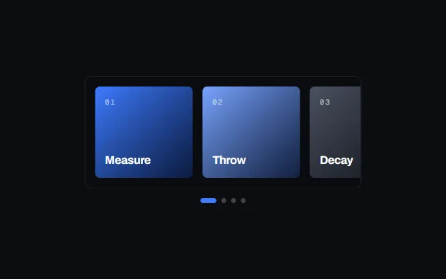</a><br><a href="https://viberdy.dev/library/drag-inertia-carousel?ref=github"><b>Drag Inertia Carousel</b></a><br><sub>A rail you can throw — it projects the momentum and settles on the nearest slide.</sub><br><sub><code>drag-inertia-carousel</code> · <a href="components/drag-inertia-carousel.tsx">code</a> · <a href="prompts/drag-inertia-carousel.md">prompt</a></sub></td><td width="33%" valign="top"><a href="https://viberdy.dev/library/draggable-bottom-sheet?ref=github">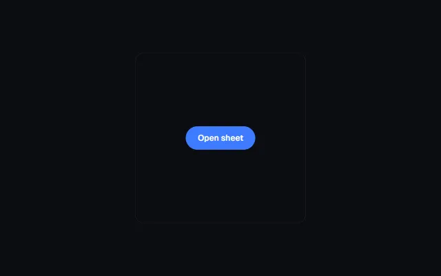</a><br><a href="https://viberdy.dev/library/draggable-bottom-sheet?ref=github"><b>Draggable Bottom Sheet Modal</b></a><br><sub>A modal sheet you can drag down to dismiss, with a distance + velocity threshold.</sub><br><sub><code>draggable-bottom-sheet</code> · <a href="components/draggable-bottom-sheet.tsx">code</a> · <a href="prompts/draggable-bottom-sheet.md">prompt</a></sub></td><td width="33%" valign="top"><a href="https://viberdy.dev/library/range-slider?ref=github">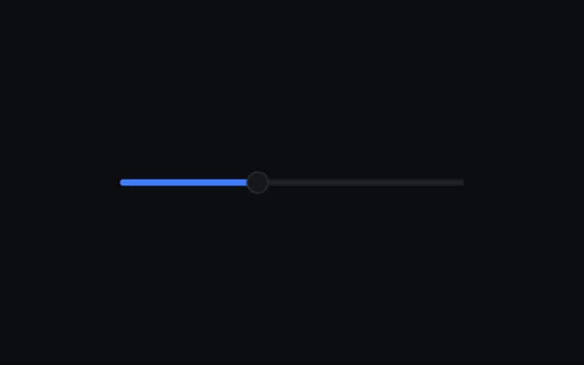</a><br><a href="https://viberdy.dev/library/range-slider?ref=github"><b>Draggable Range Slider</b></a><br><sub>A custom-styled slider with a drag handle and a value tooltip while dragging.</sub><br><sub><code>range-slider</code> · <a href="components/range-slider.tsx">code</a> · <a href="prompts/range-slider.md">prompt</a></sub></td></tr>
<tr><td width="33%" valign="top"><a href="https://viberdy.dev/library/draggable-sortable-list?ref=github">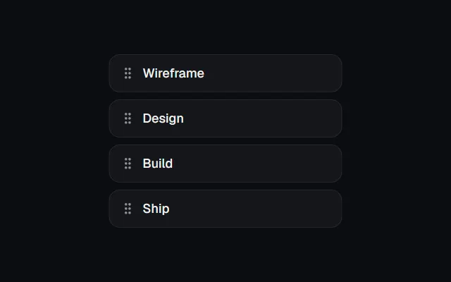</a><br><a href="https://viberdy.dev/library/draggable-sortable-list?ref=github"><b>Draggable Sortable List</b></a><br><sub>A drag-handle-driven list that reorders with a smooth layout swap.</sub><br><sub><code>draggable-sortable-list</code> · <a href="components/draggable-sortable-list.tsx">code</a> · <a href="prompts/draggable-sortable-list.md">prompt</a></sub></td><td width="33%" valign="top"><a href="https://viberdy.dev/library/expandable-search-bar?ref=github">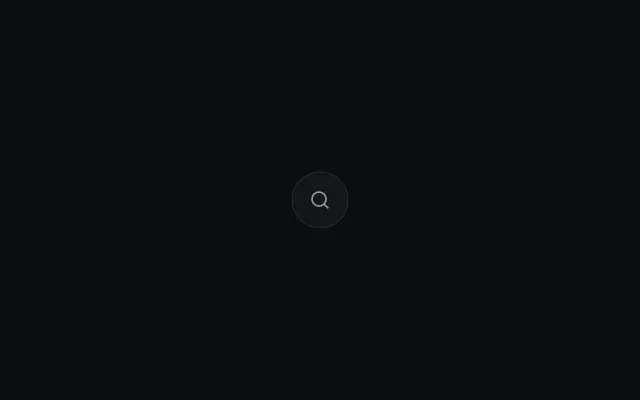</a><br><a href="https://viberdy.dev/library/expandable-search-bar?ref=github"><b>Expandable Search Bar</b></a><br><sub>A search icon that smoothly expands into a full text input on click.</sub><br><sub><code>expandable-search-bar</code> · <a href="components/expandable-search-bar.tsx">code</a> · <a href="prompts/expandable-search-bar.md">prompt</a></sub></td><td width="33%" valign="top"><a href="https://viberdy.dev/library/hover-expand-panels?ref=github">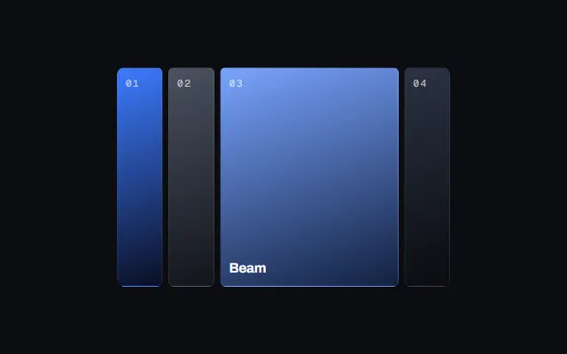</a><br><a href="https://viberdy.dev/library/hover-expand-panels?ref=github"><b>Expanding Panel Row</b></a><br><sub>A row of panels where the hovered one grows and its neighbours compress.</sub><br><sub><code>hover-expand-panels</code> · <a href="components/hover-expand-panels.tsx">code</a> · <a href="prompts/hover-expand-panels.md">prompt</a></sub></td></tr>
<tr><td width="33%" valign="top"><a href="https://viberdy.dev/library/extruded-type-tilt?ref=github">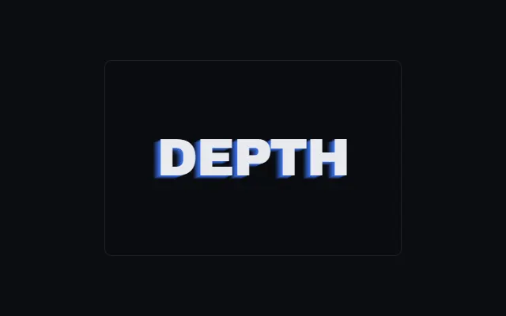</a><br><a href="https://viberdy.dev/library/extruded-type-tilt?ref=github"><b>Extruded Type Tilt</b></a><br><sub>Display type with a solid extrusion that swings around as the pointer moves.</sub><br><sub><code>extruded-type-tilt</code> · <a href="components/extruded-type-tilt.tsx">code</a> · <a href="prompts/extruded-type-tilt.md">prompt</a></sub></td><td width="33%" valign="top"><a href="https://viberdy.dev/library/file-upload-dropzone?ref=github">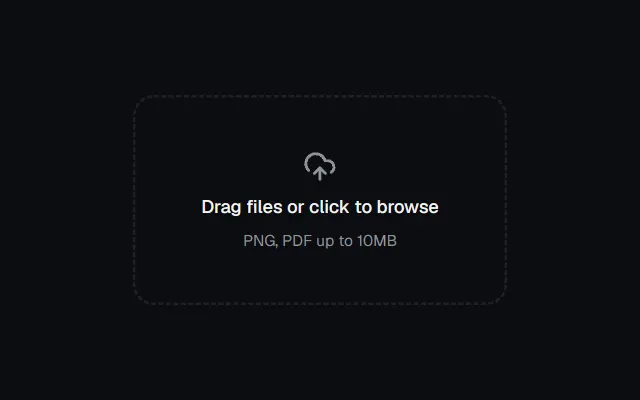</a><br><a href="https://viberdy.dev/library/file-upload-dropzone?ref=github"><b>File Upload Dropzone</b></a><br><sub>A real drag-and-drop file zone with a live dragover state and file chips.</sub><br><sub><code>file-upload-dropzone</code> · <a href="components/file-upload-dropzone.tsx">code</a> · <a href="prompts/file-upload-dropzone.md">prompt</a></sub></td><td width="33%" valign="top"><a href="https://viberdy.dev/library/flip-grid-reorder?ref=github">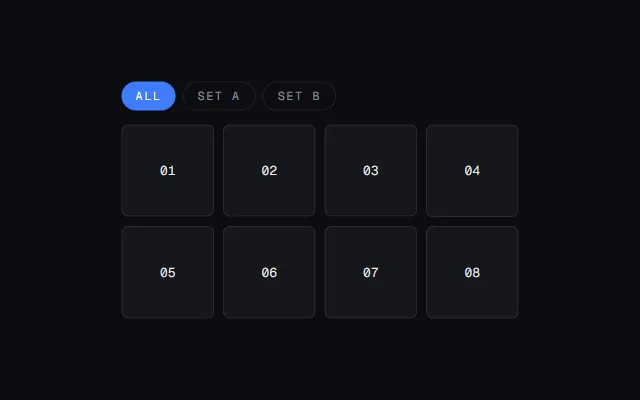</a><br><a href="https://viberdy.dev/library/flip-grid-reorder?ref=github"><b>FLIP Grid Reorder</b></a><br><sub>A filterable grid whose tiles travel to their new positions instead of snapping.</sub><br><sub><code>flip-grid-reorder</code> · <a href="components/flip-grid-reorder.tsx">code</a> · <a href="prompts/flip-grid-reorder.md">prompt</a></sub></td></tr>
<tr><td width="33%" valign="top"><a href="https://viberdy.dev/library/floating-label-input?ref=github">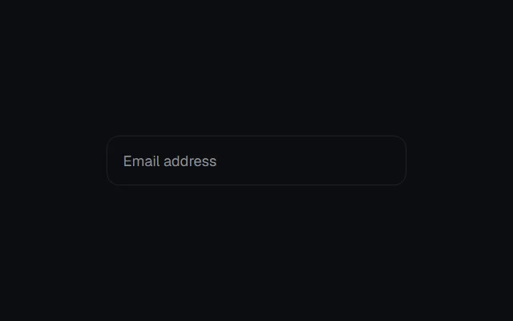</a><br><a href="https://viberdy.dev/library/floating-label-input?ref=github"><b>Floating Label Input</b></a><br><sub>A text input whose label floats from placeholder position into a caption on focus.</sub><br><sub><code>floating-label-input</code> · <a href="components/floating-label-input.tsx">code</a> · <a href="prompts/floating-label-input.md">prompt</a></sub></td><td width="33%" valign="top"><a href="https://viberdy.dev/library/fuzzy-match-input?ref=github">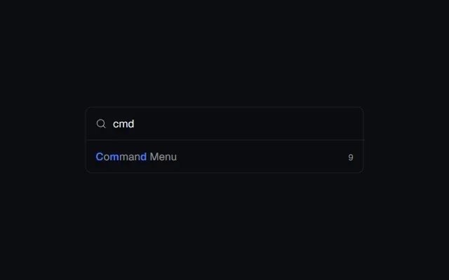</a><br><a href="https://viberdy.dev/library/fuzzy-match-input?ref=github"><b>Fuzzy Match Input</b></a><br><sub>Subsequence search that scores by run length and word starts, and highlights the hits.</sub><br><sub><code>fuzzy-match-input</code> · <a href="components/fuzzy-match-input.tsx">code</a> · <a href="prompts/fuzzy-match-input.md">prompt</a></sub></td><td width="33%" valign="top"><a href="https://viberdy.dev/library/glitch-text-hover?ref=github">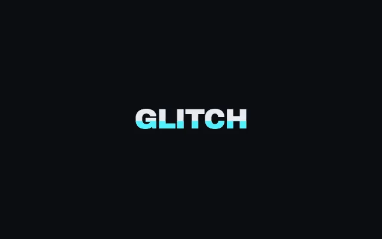</a><br><a href="https://viberdy.dev/library/glitch-text-hover?ref=github"><b>Glitch Text Hover</b></a><br><sub>An RGB-split, jittery glitch effect on text when you hover it.</sub><br><sub><code>glitch-text-hover</code> · <a href="components/glitch-text-hover.tsx">code</a> · <a href="prompts/glitch-text-hover.md">prompt</a></sub></td></tr>
<tr><td width="33%" valign="top"><a href="https://viberdy.dev/library/hide-on-scroll-navbar?ref=github">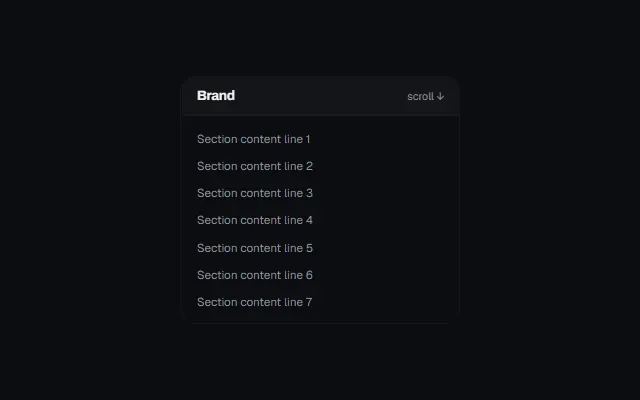</a><br><a href="https://viberdy.dev/library/hide-on-scroll-navbar?ref=github"><b>Hide On Scroll Navbar</b></a><br><sub>A navbar that slides away on scroll-down and reappears on scroll-up.</sub><br><sub><code>hide-on-scroll-navbar</code> · <a href="components/hide-on-scroll-navbar.tsx">code</a> · <a href="prompts/hide-on-scroll-navbar.md">prompt</a></sub></td><td width="33%" valign="top"><a href="https://viberdy.dev/library/image-comparison-slider?ref=github">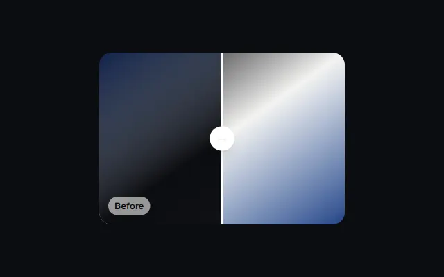</a><br><a href="https://viberdy.dev/library/image-comparison-slider?ref=github"><b>Image Comparison Slider</b></a><br><sub>A draggable before/after divider that reveals one image over another.</sub><br><sub><code>image-comparison-slider</code> · <a href="components/image-comparison-slider.tsx">code</a> · <a href="prompts/image-comparison-slider.md">prompt</a></sub></td><td width="33%" valign="top"><a href="https://viberdy.dev/library/star-rating-interactive?ref=github"></a><br><a href="https://viberdy.dev/library/star-rating-interactive?ref=github"><b>Interactive Star Rating</b></a><br><sub>A 5-star rating control with hover preview and a springy fill pop.</sub><br><sub><code>star-rating-interactive</code> · <a href="components/star-rating-interactive.tsx">code</a> · <a href="prompts/star-rating-interactive.md">prompt</a></sub></td></tr>
<tr><td width="33%" valign="top"><a href="https://viberdy.dev/library/kanban-drag-columns?ref=github">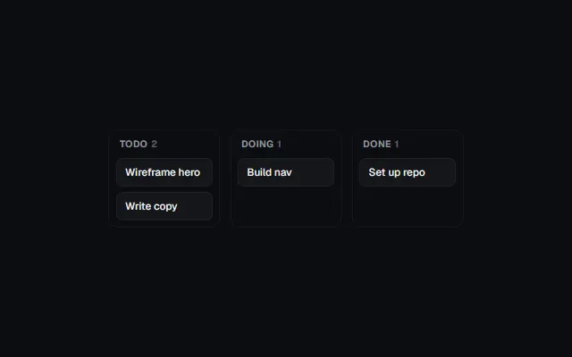</a><br><a href="https://viberdy.dev/library/kanban-drag-columns?ref=github"><b>Kanban Drag Columns</b></a><br><sub>A mini kanban board where cards drag both within and across columns.</sub><br><sub><code>kanban-drag-columns</code> · <a href="components/kanban-drag-columns.tsx">code</a> · <a href="prompts/kanban-drag-columns.md">prompt</a></sub></td><td width="33%" valign="top"><a href="https://viberdy.dev/library/hover-link-peek?ref=github">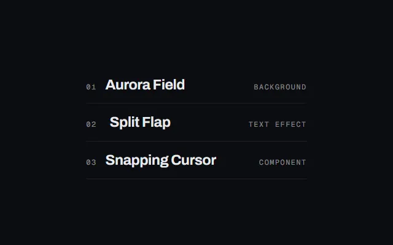</a><br><a href="https://viberdy.dev/library/hover-link-peek?ref=github"><b>Link Peek Preview</b></a><br><sub>An index list that floats a velocity-tilted preview card beside the pointer.</sub><br><sub><code>hover-link-peek</code> · <a href="components/hover-link-peek.tsx">code</a> · <a href="prompts/hover-link-peek.md">prompt</a></sub></td><td width="33%" valign="top"><a href="https://viberdy.dev/library/liquid-blob-cursor?ref=github">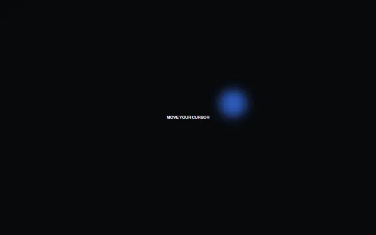</a><br><a href="https://viberdy.dev/library/liquid-blob-cursor?ref=github"><b>Liquid Blob Cursor Follow</b></a><br><sub>A soft blurred blob that trails the cursor with spring-smoothed lag.</sub><br><sub><code>liquid-blob-cursor</code> · <a href="components/liquid-blob-cursor.tsx">code</a> · <a href="prompts/liquid-blob-cursor.md">prompt</a></sub></td></tr>
<tr><td width="33%" valign="top"><a href="https://viberdy.dev/library/magnetic-button?ref=github">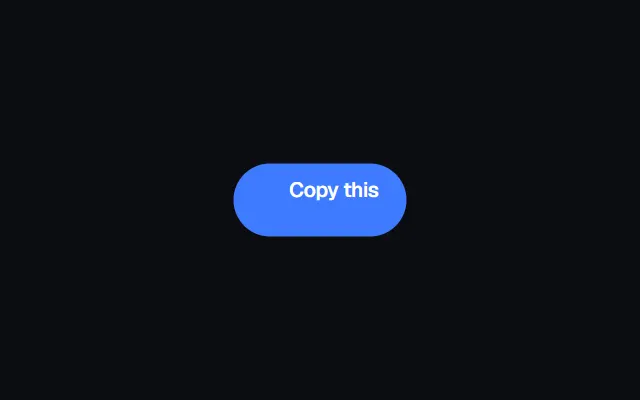</a><br><a href="https://viberdy.dev/library/magnetic-button?ref=github"><b>Magnetic Button</b></a><br><sub>A button whose label leans toward the cursor with a springy pull.</sub><br><sub><code>magnetic-button</code> · <a href="components/magnetic-button.tsx">code</a> · <a href="prompts/magnetic-button.md">prompt</a></sub></td><td width="33%" valign="top"><a href="https://viberdy.dev/library/magnetic-nav-dock?ref=github">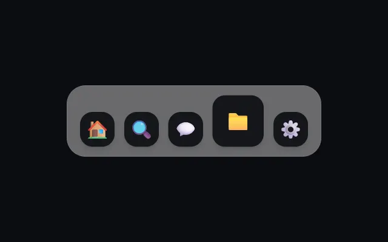</a><br><a href="https://viberdy.dev/library/magnetic-nav-dock?ref=github"><b>Magnetic Nav Dock</b></a><br><sub>A macOS-style dock where icons magnify based on real distance from the cursor.</sub><br><sub><code>magnetic-nav-dock</code> · <a href="components/magnetic-nav-dock.tsx">code</a> · <a href="prompts/magnetic-nav-dock.md">prompt</a></sub></td><td width="33%" valign="top"><a href="https://viberdy.dev/library/marquee-ticker?ref=github">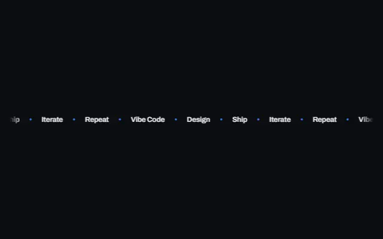</a><br><a href="https://viberdy.dev/library/marquee-ticker?ref=github"><b>Marquee Ticker</b></a><br><sub>An infinite scrolling strip of words or logos that pauses when you hover it.</sub><br><sub><code>marquee-ticker</code> · <a href="components/marquee-ticker.tsx">code</a> · <a href="prompts/marquee-ticker.md">prompt</a></sub></td></tr>
<tr><td width="33%" valign="top"><a href="https://viberdy.dev/library/morphing-hamburger-icon?ref=github">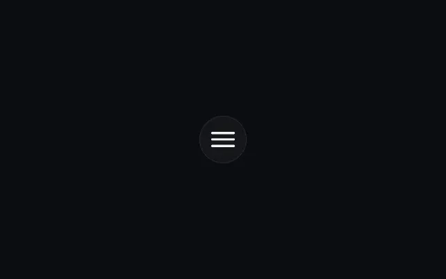</a><br><a href="https://viberdy.dev/library/morphing-hamburger-icon?ref=github"><b>Morphing Hamburger Icon</b></a><br><sub>A three-line menu icon that morphs smoothly into an X.</sub><br><sub><code>morphing-hamburger-icon</code> · <a href="components/morphing-hamburger-icon.tsx">code</a> · <a href="prompts/morphing-hamburger-icon.md">prompt</a></sub></td><td width="33%" valign="top"><a href="https://viberdy.dev/library/morphing-island-notch?ref=github">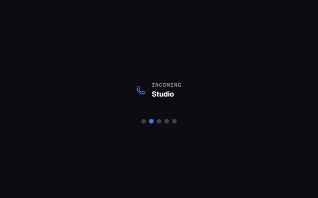</a><br><a href="https://viberdy.dev/library/morphing-island-notch?ref=github"><b>Morphing Island Notch</b></a><br><sub>A status pill that resizes itself fluidly around whatever content it holds.</sub><br><sub><code>morphing-island-notch</code> · <a href="components/morphing-island-notch.tsx">code</a> · <a href="prompts/morphing-island-notch.md">prompt</a></sub></td><td width="33%" valign="top"><a href="https://viberdy.dev/library/odometer-counter?ref=github">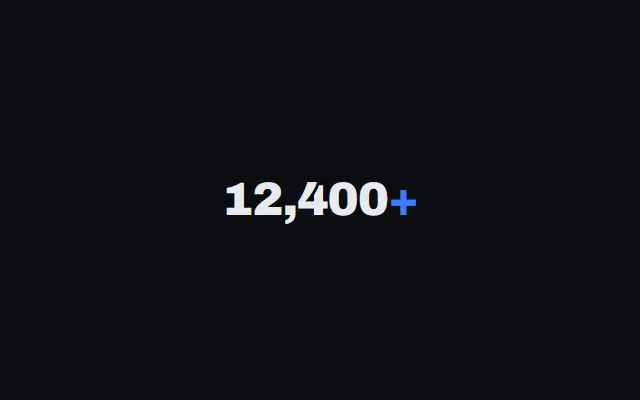</a><br><a href="https://viberdy.dev/library/odometer-counter?ref=github"><b>Odometer Counter</b></a><br><sub>A stat number that rolls up from zero to its target the moment it's in view.</sub><br><sub><code>odometer-counter</code> · <a href="components/odometer-counter.tsx">code</a> · <a href="prompts/odometer-counter.md">prompt</a></sub></td></tr>
<tr><td width="33%" valign="top"><a href="https://viberdy.dev/library/otp-code-input?ref=github">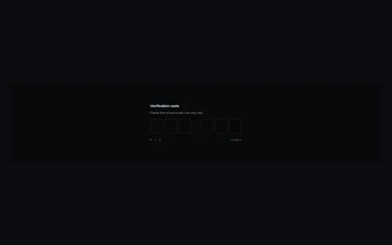</a><br><a href="https://viberdy.dev/library/otp-code-input?ref=github"><b>OTP Code Input</b></a><br><sub>A one-time-code field whose cells survive SMS autofill, paste and Android backspace.</sub><br><sub><code>otp-code-input</code> · <a href="components/otp-code-input.tsx">code</a> · <a href="prompts/otp-code-input.md">prompt</a></sub></td><td width="33%" valign="top"><a href="https://viberdy.dev/library/path-follow-scroll?ref=github">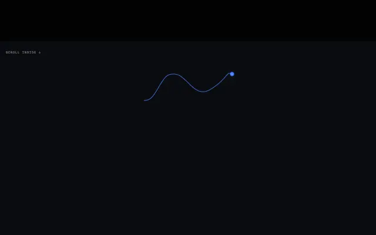</a><br><a href="https://viberdy.dev/library/path-follow-scroll?ref=github"><b>Path Follow Scroll</b></a><br><sub>A marker that rides an SVG curve on scroll, banking through the bends.</sub><br><sub><code>path-follow-scroll</code> · <a href="components/path-follow-scroll.tsx">code</a> · <a href="prompts/path-follow-scroll.md">prompt</a></sub></td><td width="33%" valign="top"><a href="https://viberdy.dev/library/pointer-parallax-scene?ref=github">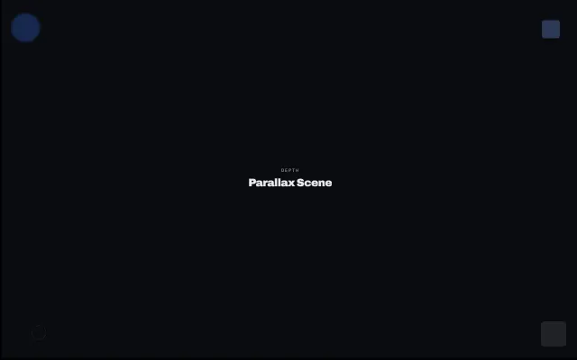</a><br><a href="https://viberdy.dev/library/pointer-parallax-scene?ref=github"><b>Pointer Parallax Scene</b></a><br><sub>A depth system where layers separate under the pointer from one shared motion source.</sub><br><sub><code>pointer-parallax-scene</code> · <a href="components/pointer-parallax-scene.tsx">code</a> · <a href="prompts/pointer-parallax-scene.md">prompt</a></sub></td></tr>
<tr><td width="33%" valign="top"><a href="https://viberdy.dev/library/pricing-toggle-switch?ref=github">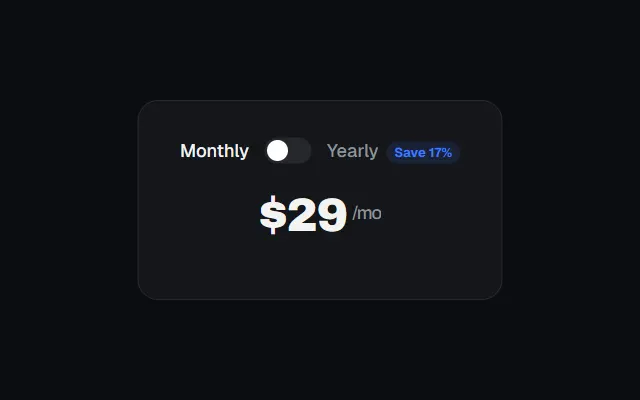</a><br><a href="https://viberdy.dev/library/pricing-toggle-switch?ref=github"><b>Pricing Toggle Switch</b></a><br><sub>A monthly/yearly billing switch with the price sliding to its new value.</sub><br><sub><code>pricing-toggle-switch</code> · <a href="components/pricing-toggle-switch.tsx">code</a> · <a href="prompts/pricing-toggle-switch.md">prompt</a></sub></td><td width="33%" valign="top"><a href="https://viberdy.dev/library/ripple-click-effect?ref=github">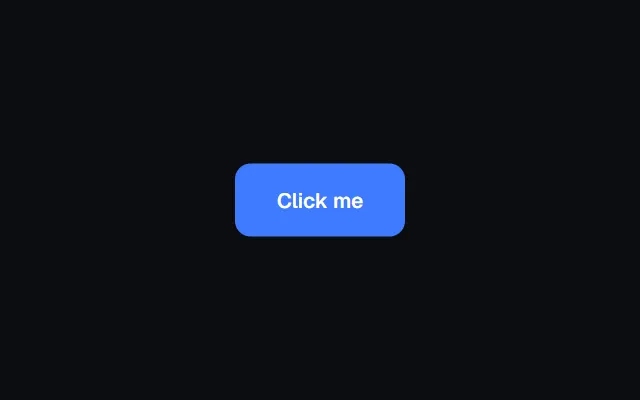</a><br><a href="https://viberdy.dev/library/ripple-click-effect?ref=github"><b>Ripple Click Effect</b></a><br><sub>A Material-style ripple that expands from the exact click point.</sub><br><sub><code>ripple-click-effect</code> · <a href="components/ripple-click-effect.tsx">code</a> · <a href="prompts/ripple-click-effect.md">prompt</a></sub></td><td width="33%" valign="top"><a href="https://viberdy.dev/library/rotating-word-swap?ref=github">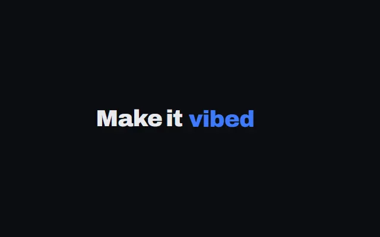</a><br><a href="https://viberdy.dev/library/rotating-word-swap?ref=github"><b>Rotating Word Swap Headline</b></a><br><sub>A headline where one word auto-cycles with a vertical odometer-style swap.</sub><br><sub><code>rotating-word-swap</code> · <a href="components/rotating-word-swap.tsx">code</a> · <a href="prompts/rotating-word-swap.md">prompt</a></sub></td></tr>
<tr><td width="33%" valign="top"><a href="https://viberdy.dev/library/scramble-text?ref=github">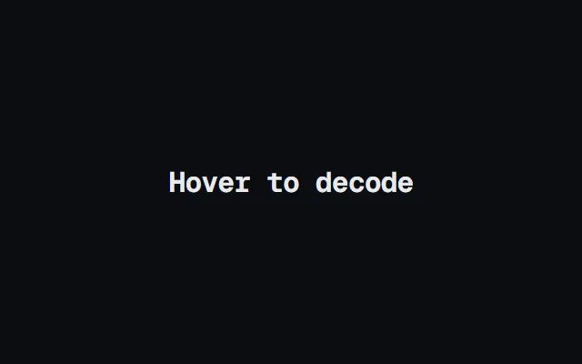</a><br><a href="https://viberdy.dev/library/scramble-text?ref=github"><b>Scramble Text</b></a><br><sub>Text that decodes from random characters into its real word on hover.</sub><br><sub><code>scramble-text</code> · <a href="components/scramble-text.tsx">code</a> · <a href="prompts/scramble-text.md">prompt</a></sub></td><td width="33%" valign="top"><a href="https://viberdy.dev/library/scrub-timeline-player?ref=github">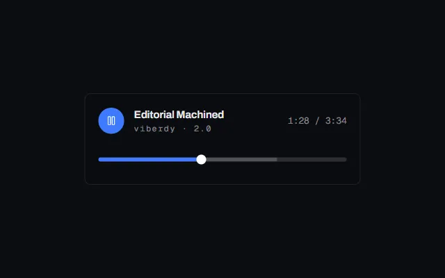</a><br><a href="https://viberdy.dev/library/scrub-timeline-player?ref=github"><b>Scrub Timeline Player</b></a><br><sub>A media scrubber with buffered range, hover timestamp and pointer-capture dragging.</sub><br><sub><code>scrub-timeline-player</code> · <a href="components/scrub-timeline-player.tsx">code</a> · <a href="prompts/scrub-timeline-player.md">prompt</a></sub></td><td width="33%" valign="top"><a href="https://viberdy.dev/library/searchable-faq-accordion?ref=github">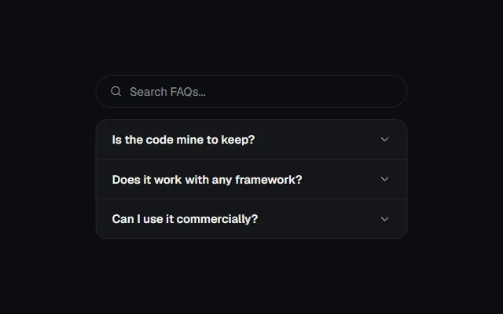</a><br><a href="https://viberdy.dev/library/searchable-faq-accordion?ref=github"><b>Searchable FAQ Accordion</b></a><br><sub>A filterable FAQ list where each answer expands independently.</sub><br><sub><code>searchable-faq-accordion</code> · <a href="components/searchable-faq-accordion.tsx">code</a> · <a href="prompts/searchable-faq-accordion.md">prompt</a></sub></td></tr>
<tr><td width="33%" valign="top"><a href="https://viberdy.dev/library/segmented-control?ref=github">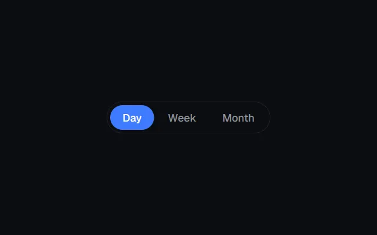</a><br><a href="https://viberdy.dev/library/segmented-control?ref=github"><b>Segmented Control</b></a><br><sub>An iOS-style pill switch whose highlight slides between options.</sub><br><sub><code>segmented-control</code> · <a href="components/segmented-control.tsx">code</a> · <a href="prompts/segmented-control.md">prompt</a></sub></td><td width="33%" valign="top"><a href="https://viberdy.dev/library/share-button-expand?ref=github">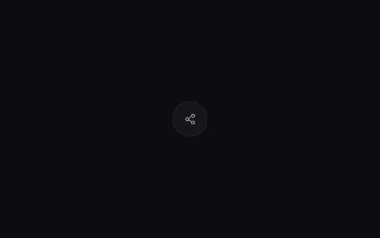</a><br><a href="https://viberdy.dev/library/share-button-expand?ref=github"><b>Share Button Expand</b></a><br><sub>A share icon that expands into a row of social options with a copy-link state.</sub><br><sub><code>share-button-expand</code> · <a href="components/share-button-expand.tsx">code</a> · <a href="prompts/share-button-expand.md">prompt</a></sub></td><td width="33%" valign="top"><a href="https://viberdy.dev/library/hover-slice-shear?ref=github">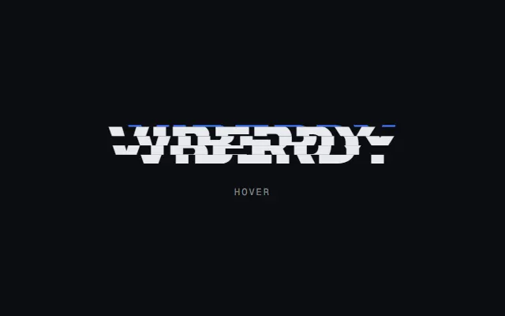</a><br><a href="https://viberdy.dev/library/hover-slice-shear?ref=github"><b>Slice Shear Hover</b></a><br><sub>Display type cut into horizontal bands that fan apart under the pointer.</sub><br><sub><code>hover-slice-shear</code> · <a href="components/hover-slice-shear.tsx">code</a> · <a href="prompts/hover-slice-shear.md">prompt</a></sub></td></tr>
<tr><td width="33%" valign="top"><a href="https://viberdy.dev/library/cursor-snap-target?ref=github">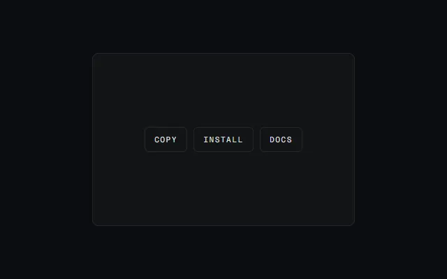</a><br><a href="https://viberdy.dev/library/cursor-snap-target?ref=github"><b>Snapping Cursor</b></a><br><sub>A cursor dot that latches onto interactive elements and takes their exact shape.</sub><br><sub><code>cursor-snap-target</code> · <a href="components/cursor-snap-target.tsx">code</a> · <a href="prompts/cursor-snap-target.md">prompt</a></sub></td><td width="33%" valign="top"><a href="https://viberdy.dev/library/spotlight-grid?ref=github">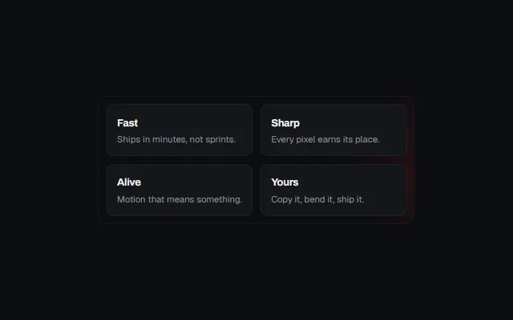</a><br><a href="https://viberdy.dev/library/spotlight-grid?ref=github"><b>Spotlight Card Grid</b></a><br><sub>A card grid with a soft red spotlight that follows the cursor across it.</sub><br><sub><code>spotlight-grid</code> · <a href="components/spotlight-grid.tsx">code</a> · <a href="prompts/spotlight-grid.md">prompt</a></sub></td><td width="33%" valign="top"><a href="https://viberdy.dev/library/stacked-type-hero?ref=github">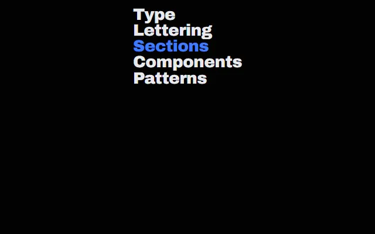</a><br><a href="https://viberdy.dev/library/stacked-type-hero?ref=github"><b>Stacked Type Hero</b></a><br><sub>Oversized, tightly-stacked headline words that reveal in on mount — big type as sculpture.</sub><br><sub><code>stacked-type-hero</code> · <a href="components/stacked-type-hero.tsx">code</a> · <a href="prompts/stacked-type-hero.md">prompt</a></sub></td></tr>
<tr><td width="33%" valign="top"><a href="https://viberdy.dev/library/sticky-scroll-stack?ref=github">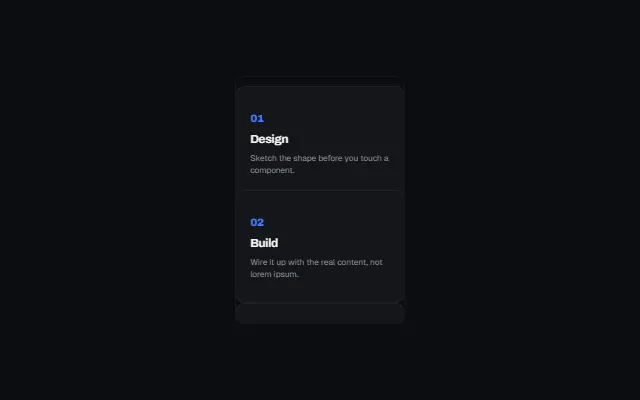</a><br><a href="https://viberdy.dev/library/sticky-scroll-stack?ref=github"><b>Sticky Scroll Stack</b></a><br><sub>Cards that pin and stack on top of each other as you scroll past.</sub><br><sub><code>sticky-scroll-stack</code> · <a href="components/sticky-scroll-stack.tsx">code</a> · <a href="prompts/sticky-scroll-stack.md">prompt</a></sub></td><td width="33%" valign="top"><a href="https://viberdy.dev/library/hover-stroke-draw-button?ref=github">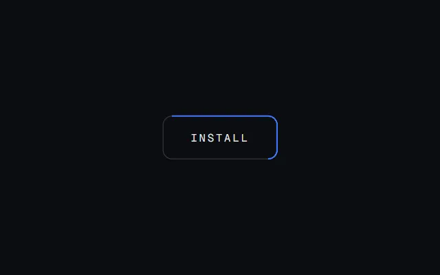</a><br><a href="https://viberdy.dev/library/hover-stroke-draw-button?ref=github"><b>Stroke Draw Button</b></a><br><sub>A button whose outline draws itself around the shape on hover, at any size.</sub><br><sub><code>hover-stroke-draw-button</code> · <a href="components/hover-stroke-draw-button.tsx">code</a> · <a href="prompts/hover-stroke-draw-button.md">prompt</a></sub></td><td width="33%" valign="top"><a href="https://viberdy.dev/library/swatch-fan-deck?ref=github">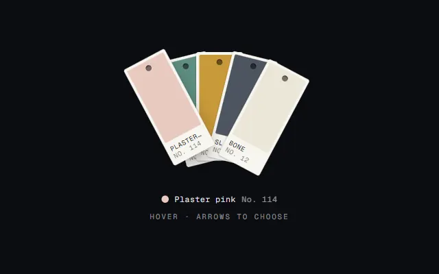</a><br><a href="https://viberdy.dev/library/swatch-fan-deck?ref=github"><b>Swatch Fan Deck</b></a><br><sub>A fan deck of paint chips that spreads in your hand on hover or focus — a real radio group, with arrow keys and the colour's name, not its hex.</sub><br><sub><code>swatch-fan-deck</code> · <a href="components/swatch-fan-deck.tsx">code</a> · <a href="prompts/swatch-fan-deck.md">prompt</a></sub></td></tr>
<tr><td width="33%" valign="top"><a href="https://viberdy.dev/library/swipe-card-stack?ref=github">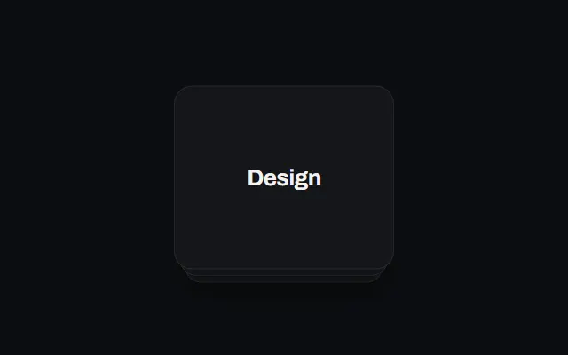</a><br><a href="https://viberdy.dev/library/swipe-card-stack?ref=github"><b>Swipe Card Stack</b></a><br><sub>A draggable deck of cards you flick away to cycle through, Tinder-style.</sub><br><sub><code>swipe-card-stack</code> · <a href="components/swipe-card-stack.tsx">code</a> · <a href="prompts/swipe-card-stack.md">prompt</a></sub></td><td width="33%" valign="top"><a href="https://viberdy.dev/library/testimonial-carousel?ref=github">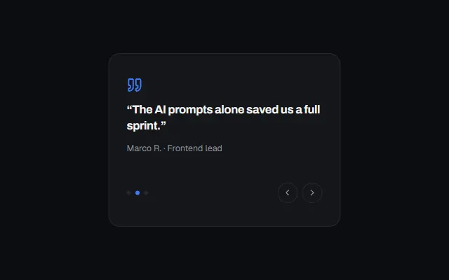</a><br><a href="https://viberdy.dev/library/testimonial-carousel?ref=github"><b>Testimonial Carousel</b></a><br><sub>An auto-advancing quote carousel with directional slide transitions.</sub><br><sub><code>testimonial-carousel</code> · <a href="components/testimonial-carousel.tsx">code</a> · <a href="prompts/testimonial-carousel.md">prompt</a></sub></td><td width="33%" valign="top"><a href="https://viberdy.dev/library/theme-toggle-sun-moon-morph?ref=github">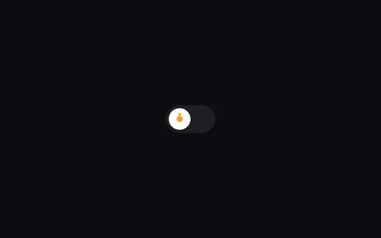</a><br><a href="https://viberdy.dev/library/theme-toggle-sun-moon-morph?ref=github"><b>Theme Toggle Sun Moon Morph</b></a><br><sub>A track+thumb switch whose icon morphs between a sun and a crescent moon.</sub><br><sub><code>theme-toggle-sun-moon-morph</code> · <a href="components/theme-toggle-sun-moon-morph.tsx">code</a> · <a href="prompts/theme-toggle-sun-moon-morph.md">prompt</a></sub></td></tr>
<tr><td width="33%" valign="top"><a href="https://viberdy.dev/library/tilt-card?ref=github">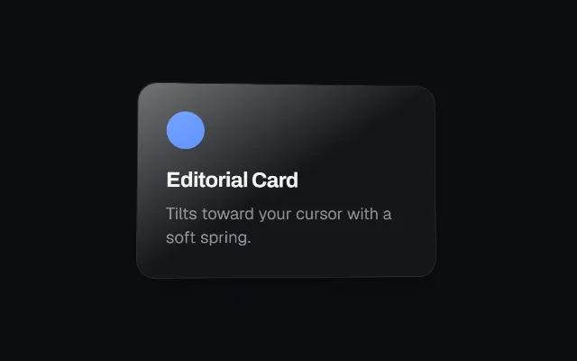</a><br><a href="https://viberdy.dev/library/tilt-card?ref=github"><b>Tilt Card</b></a><br><sub>A 3D card that tilts toward the cursor with spring physics.</sub><br><sub><code>tilt-card</code> · <a href="components/tilt-card.tsx">code</a> · <a href="prompts/tilt-card.md">prompt</a></sub></td><td width="33%" valign="top"><a href="https://viberdy.dev/library/toast-stack?ref=github">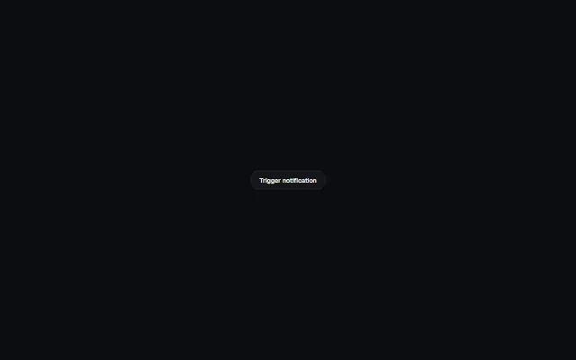</a><br><a href="https://viberdy.dev/library/toast-stack?ref=github"><b>Toast Notification Stack</b></a><br><sub>A queue of toast notifications that stack, reflow, and auto-dismiss independently.</sub><br><sub><code>toast-stack</code> · <a href="components/toast-stack.tsx">code</a> · <a href="prompts/toast-stack.md">prompt</a></sub></td><td width="33%" valign="top"><a href="https://viberdy.dev/library/typewriter-text?ref=github">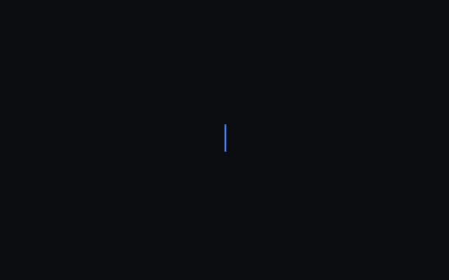</a><br><a href="https://viberdy.dev/library/typewriter-text?ref=github"><b>Typewriter Text</b></a><br><sub>Text that types itself out character by character, then cycles to the next phrase.</sub><br><sub><code>typewriter-text</code> · <a href="components/typewriter-text.tsx">code</a> · <a href="prompts/typewriter-text.md">prompt</a></sub></td></tr>
<tr><td width="33%" valign="top"><a href="https://viberdy.dev/library/velocity-marquee-rail?ref=github">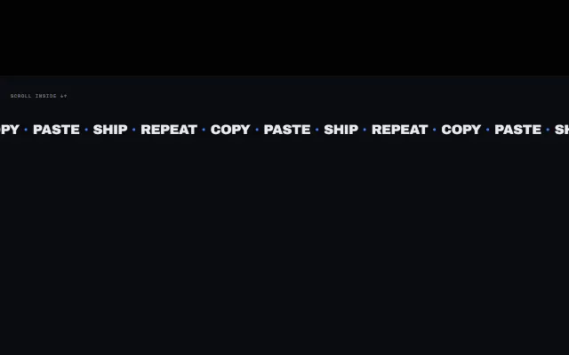</a><br><a href="https://viberdy.dev/library/velocity-marquee-rail?ref=github"><b>Velocity Marquee Rail</b></a><br><sub>A marquee that accelerates with scroll speed and flips direction when you scroll back.</sub><br><sub><code>velocity-marquee-rail</code> · <a href="components/velocity-marquee-rail.tsx">code</a> · <a href="prompts/velocity-marquee-rail.md">prompt</a></sub></td><td width="33%" valign="top"><a href="https://viberdy.dev/library/vertical-timeline-reveal?ref=github">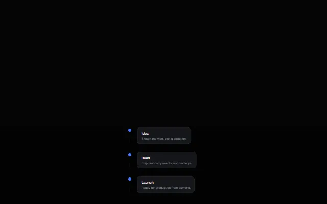</a><br><a href="https://viberdy.dev/library/vertical-timeline-reveal?ref=github"><b>Vertical Timeline Reveal</b></a><br><sub>A scroll-triggered vertical timeline whose dots and cards reveal in sequence.</sub><br><sub><code>vertical-timeline-reveal</code> · <a href="components/vertical-timeline-reveal.tsx">code</a> · <a href="prompts/vertical-timeline-reveal.md">prompt</a></sub></td><td width="33%" valign="top"><a href="https://viberdy.dev/library/window-light-drift?ref=github">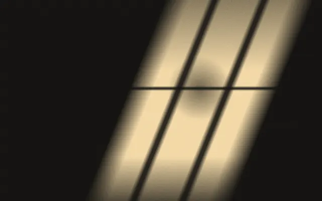</a><br><a href="https://viberdy.dev/library/window-light-drift?ref=github"><b>Window Light Drift</b></a><br><sub>Afternoon sun through a window, crossing a plaster wall over ninety seconds — and your pointer casts a shadow in it.</sub><br><sub><code>window-light-drift</code> · <a href="components/window-light-drift.tsx">code</a> · <a href="prompts/window-light-drift.md">prompt</a></sub></td></tr>
<tr><td width="33%" valign="top"><a href="https://viberdy.dev/library/grain-overlay?ref=github"><b>Grain Overlay</b></a><br><sub>A subtle animated film-grain texture layered over any section via canvas.</sub><br><sub><code>grain-overlay</code> · <a href="components/grain-overlay.tsx">code</a> · <a href="prompts/grain-overlay.md">prompt</a></sub></td><td width="33%" valign="top"><a href="https://viberdy.dev/library/masonry-image-hover-grid?ref=github"><b>Masonry Image Hover Grid</b></a><br><sub>A CSS-columns masonry gallery with a scale + caption reveal on hover.</sub><br><sub><code>masonry-image-hover-grid</code> · <a href="components/masonry-image-hover-grid.tsx">code</a> · <a href="prompts/masonry-image-hover-grid.md">prompt</a></sub></td><td width="33%" valign="top"><a href="https://viberdy.dev/library/page-loading-bar?ref=github"><b>Page Loading Bar</b></a><br><sub>An nprogress-style top-of-page bar that eases toward completion, never stalling.</sub><br><sub><code>page-loading-bar</code> · <a href="components/page-loading-bar.tsx">code</a> · <a href="prompts/page-loading-bar.md">prompt</a></sub></td></tr>
<tr><td width="33%" valign="top"><a href="https://viberdy.dev/library/scroll-card-deal?ref=github"><b>Scroll Card Deal</b></a><br><sub>A pile of cards that fans out symmetrically as its section crosses the viewport.</sub><br><sub><code>scroll-card-deal</code> · <a href="components/scroll-card-deal.tsx">code</a> · <a href="prompts/scroll-card-deal.md">prompt</a></sub></td><td width="33%" valign="top"><a href="https://viberdy.dev/library/scroll-linked-image-mask-reveal?ref=github"><b>Scroll-Linked Image Mask Reveal</b></a><br><sub>An image whose circular clip-path mask grows and shrinks in lockstep with scroll.</sub><br><sub><code>scroll-linked-image-mask-reveal</code> · <a href="components/scroll-linked-image-mask-reveal.tsx">code</a> · <a href="prompts/scroll-linked-image-mask-reveal.md">prompt</a></sub></td><td width="33%" valign="top"><a href="https://viberdy.dev/library/skeleton-shimmer?ref=github"><b>Skeleton Shimmer Loader</b></a><br><sub>Loading-state placeholder blocks with a light sweep animating across them.</sub><br><sub><code>skeleton-shimmer</code> · <a href="components/skeleton-shimmer.tsx">code</a> · <a href="prompts/skeleton-shimmer.md">prompt</a></sub></td></tr>
</table>

## AI prompts

Each component has the prompt that describes it in [`prompts/`](prompts): the behaviour, the motion values and the edge cases, written for an AI coding tool. Paste one into Cursor, Claude Code, v0, Lovable or Bolt to rebuild the component in your own stack, or change a line first to get a variation that doesn't look like everyone else's.

## About viberdy.dev

This repo is the free tier of [viberdy.dev](https://viberdy.dev?ref=github), a library built one design style at a time. [Pro](https://viberdy.dev/pricing?ref=github) (paid) adds the rest of each style's kit: heroes, page templates and complete sites. These 161 are complete on their own and stay under this license.

## Contributing

Pull requests aren't merged: these files are generated from a private source, and a merge would be overwritten on the next export. [Open an issue](https://github.com/viberdy-dev/ui/issues/new/choose) instead, or open a PR that shows the fix; it gets applied at the source and credited in the commit.

## License

Source-available, not open source: MIT with the Commons Clause ([LICENSE](LICENSE)). You can use and modify any component in personal, commercial and client work, including work you're paid for. You can't sell the components, or charge for hosting or support of them, as a component library, UI kit or template collection.
